阿里工程师的自我修养
=================
#### 技术人具备“结构化思维”意味着什么？
- 作者：张建飞　高级技术专家
- 阿里妹导读：在日常工作中，我们时常会碰到这样的情况，有的人讲事情逻辑非常混乱，罗列了很多事项，却把握不到重点，无法把一件事情说清楚。这种思维混乱是典型的缺少结构化思维的表现。结构化思维非常重要，不仅仅体现在表达上，也体现在在我们分析问题的过程中。具备结构化思维，才能将问题分析地更全面、更深刻。
1. 什么是结构化思维？
	- 那么到底是什么是结构化思维呢？简单来说，结构化思维的定义就是：逻辑+套路。
	- 表达要有逻辑
		- 所谓逻辑是指我们的结构之间必须是有逻辑关系的。例如，你说话的时候用“第一、第二、第三”这个逻辑顺序是合理的，但是，用“第一，第二，第四”就会显得很奇怪。当然，即使你用了”一、二、三”，也不一定就意味着你的内容有逻辑关系。
		- 想让内容有逻辑关系，我们要学会四种组织思想的逻辑关系：
			- 1）演绎（因果）顺序：“大前提、小前提、结论”的演绎推理方式就是演绎顺序。比如，经典三段论：所有人都要死，苏格拉底是人，苏格拉底要死。
			- 2）时间（步骤）顺序：“第一、第二、第三”，“首先、然后、再者”等，很多的时间顺序同时也是因果顺序。
			- 3）空间（结构）顺序：“前端、后端、数据”，“波士顿、纽约、华盛顿”，化整为零（将整体分解为部分）等都是空间顺序。
			- 4）程度（重要性）顺序：比如“最重要、次重要、不重要”等。
		- 实际上，所有的逻辑关系都在这四种顺序之内。只要我们的思想和表达在这四种逻辑顺序之内，就是有逻辑的，否则就会显得没有逻辑性。
	- 做事要有套路
		- 套路是指我们解决问题的方法论，这个也非常重要。比如，5W2H 分析法就是一个非常好的，可以帮助我们分析问题的一个”套路”。试想一下，面对任何一个问题，你都能从 Why、Who、When、Where、What、How 和 How much（如下图所示），七个方面去思考。是不是比不知道这个方法论的人，用点状的思考，5W2H 分析法就全面得多。
		- 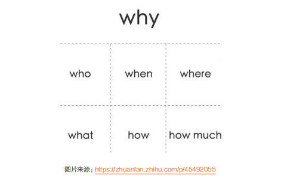
		- 例如，我们在对问题域进行分析和领域知识提炼的时候，就可以用上 5W2H。5W2H 模型给出了具有指导意义的约束，要求我们提炼的领域知识必须具备模型的六个要素。这就好比两位侃侃而谈的交谈者，因为有了确定的主题与话题边界，一场本来是漫无目的野鹤闲云似的闲聊就变成了一次深度交流的专题高端对话。
		- 
	- 逻辑是一种能力，而套路是方法论，是经验。逻辑是道的东西，而方法论是术的东西。二者都很重要，只有熟练的掌握二者我们才能更好的进行结构化思考。
1. 如何进行结构化思考？
	- 逻辑性和方法论是结构化思维的底层，那么如何进行结构化思考呢？这也是有方法论的，总的来说是有两个步骤，首先是“建立中心”，然后再进行“分解”。
	- 建立中心
		- 建立中心也就是要定义清楚要解决的问题，要明确目标。是我们结构的顶层节点，也是一种以终为始的思考方式。也就是说，我们首先要搞清楚 why，然后再进行 how。
		- ★ 建立中心有两种方式：
			- 自上而下：适用于问题比较明确的情况，我们只需要找到问题的核心要素即可，然后进行展开即可。
			- 自下而上：对于问题不够明确的情况，我们需要对多种杂乱的内容，进行分类、剪枝、归纳汇总成一个中心。
		- 建立中心通常不会是一次成型的，随着对问题理解的变化，对中心的抽象也会进行相应的调整。不同的抽象层次其面对的问题宽度是不一样的。具体要用哪个层次的抽象作为“中心”，要视具体情况而定。
		- 比如面对“系统 bug 多”的问题，向上抽象是“提升代码质量”，向下抽象是“加强测试”，都可以作为中心，选择哪个为中心取决于你当前要解决的问题是什么。
		- 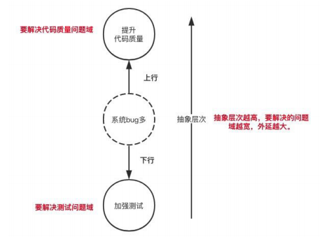
	- 结构化分解
		- 确定完中心之后，我们需要构建一个结构，使用结构化的思维对问题进行分解。分解的策略就是我们上文提到的四种逻辑顺序，即演绎顺序、时间顺序、空间顺序和程度顺序。
		- 在做空间分解的时候，要注意满足 MECE（Mutually Exclusive Collectively Exhaustive，相互独立，完全穷尽）原则。
		- 比如我们要对衣服进行分类，如果按照季节和风格进行分类，就会出现互相重叠，并且不能穷尽的情况，也就不满足 MECE。这种分类是逻辑混乱的。
		- 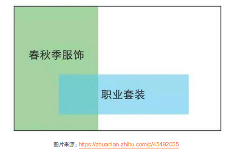
		- 我们可以按季节分：春秋装，冬装，夏装。除了这 3 类之外，没有其他季节了，这个就是「不遗漏」。
		- 
1. 结构化思维应用
- 如何落地新团队？
	- 想象这样一个场景，你刚刚入职一家新公司，或者转岗到一个新团队，作为一个技术人，你将如何落地开展你的工作呢？这里，我们就能用上结构化思维来帮我们理清思路，从而有条不紊的开展工作了。我们要知道对一个企业来说，核心要素无外乎就是业务、技术和人，也就是说这三个要素是我们要建立的中心。基于这个中心，我们可以进行进一步拆解，形成子结构。然后对子结构再进行分析找到应对策略。这样一步步递进，我们就已经在用结构化思维解决如何落地新团队的问题了。
	- 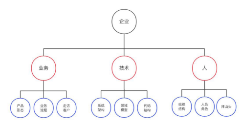
	★ 1. 熟悉业务
	1）了解产品：任何一个团队都有自己要负责的产品，申请一个测试账号去用一下产品，是熟悉产品比较好的方式。
	2）了解流程：任何业务都有自己的业务流程，而业务流里面最核心的是信息流。我们可以通过人员采访，了解关键节点的信息输入和信息输出；可以画一些泳道活动图，理清楚系统的主要角色，以及他们之间的交互关系。
	3）客户走访：通过走访客户，我们可以更加获得业务的第一手资料，更加贴近业务和客户诉求。
	★ 2. 熟悉技术
	1）了解系统架构：可以让团队的技术人员介绍下他们当初系统设计和架构的思路。
	2）了解领域模型：查看关键的核心表结构和系统 API，这样可以快速了解系统的领域模型。
	3）了解代码结构：下载系统工程，熟悉整个工程结构和模块职责。以一个最重要的流程为入手点，阅读代码，看清楚核心的执行逻辑。做一个小需求，掌握相关的流程和权限。
	★ 3. 熟悉人
	1）了解组织结构：查看公司的组织树，知道公司大概是如何运作的，以及哪些是KP（Key Person，关键人）。比如，一个典型的电商公司会包括产品部、运营部、销售部、技术部、人力资源部、财务部、法务部等。
	2）了解人员角色：了解公司都有哪些岗位，以及各岗位的职责范围。
	3）拜山头：找到和自己工作息息相关的岗位人员，比如产品和运营。积极和他们沟通，向他们请教业务问题，多多交流。这样一方面可以建立更好的人际关系，另一方面也可以更快地熟悉业务。
- 打造极客文化
	- 我最近刚刚转岗到新部门，新部门的老板抛给我一个命题：如何帮助技术团队打造极客文化？
	- 这个问题的中心很明确，接下来，看看我是如何使用结构化思维来解这个问题的。首先我们从空间顺序进行分解，也就是打造极客文化，我们可以去做哪些事情。
	- 空间顺序分解
	- 
	- 确定完要做的事情，我们还可以按照时间顺序对如何落地这些事情进行分解。
	- 时间顺序分解
	- 
	- 这样把按照这两个维度进行结构化拆解的方案给到老板，老板就会很清晰地知道你的规划和落地策略了。
- 如何做晋升述职
	- 作者在阿里巴巴已经做了好几年的晋升评委，发现很多同学都缺乏结构化思维，冗长的 PPT 里，却不能把价值说清楚，不能把推导过程说清楚。实际上，我们需要有一些方法论来指导我们进行关键述职。
	- 接下来，我主要说一下述职中存在的两个典型问题：“罗列事情”和“价值的背后”。
	- ★ 1. 罗列事情
		- 对自己做过的事情进行简单罗列，也许你的确做了不少事情。但是不能体现你对问题思考的深度和做这个事情带来的价值。这样的述职很难打动评委，更结构化的表达应该是：“提出问题，定义问题，分析问题，解决问题，最后是展望未来”。
		- 
		- 这是一个经典的表述问题的结构，也是麦肯锡推荐的问题解决的框架。
		- 类似的框架还有 zoom in/zoom out。我们说事情时，应该像电影镜头一样，先从远拉近，再由近拉远。zoom in 是先从宏观背景开始，首先让大家知道你的事情发生的背景，为什么这事重要？然后讲到具体细节，怎么做成的？解决了什么问题？背后的思考是什么？最后 Zoom out，再从细节调回到整体，结果是什么，带来的客户价值是什么，你对未来的思考是什么。
	- ★ 2. 价值的背后
		- 把价值说清楚的确很重要，正所谓：路走对了，就不怕远。如果你连价值都不明确，后面做的再多也是白搭。但是，仅仅阐述价值也是不够的，会让人觉得你有邀功之嫌。
		- 比如你说：“我主导研发的风控系统把公司的坏账率从 5% 降低到 2%”。这样的表述是不够的，你还需要把价值背后的过程和思考说清楚。对于这个结果，评委可能会问：
			- 之前为什么那么高？
			- 为什么你的方法可以降低？是如何归因的？
			- 具体解决了什么问题？
			- 是否可以总结出一套办法，以后别人也能用这个办法解决这些问题？
		- 如果你在评委提问之前，就能对这些问题进行深入思考和适当呈现。那么你就是既有结果又有过程了。
		- 通过这些案例，我们可以看到具备结构化思维，可以帮助我们快速的理清处理问题的思路，提升工作效率。经常锻炼结构化思维，可以极大的提升我们职场竞争力，让工作有条不紊，事半功倍。
		- 参考资料：
		-《思维混乱，是因为大脑没有结构》
		- https://zhuanlan.zhihu.com/p/45492055
#### 优秀工程师必备的三大思维，你拥有哪些？
- 作者：至简　高级技术专家
- 阿里妹导读：不同岗位、不同职责的技术人对工程师思维的深度要求是不一样的，但从多维度去思考却应是每个技术人都应该具备的素养。本文整理自阿里巴巴高级技术专家至简在团队内部的个人分享，希望通过对工程师思维的分析和解读，让大家能正确对待那些在现实工作中看上去与本职岗位无关，却对团队效能影响极大的一些点和一些事。
- 作者简介：至简，阿里巴巴高级技术专家，是集团 Service Mesh 方向的重要参与者和推动者。曾出版《专业嵌入式软件开发——全面走向高质高效编程》一书，坚信和倡导软件设计是软件质量之根本，并对软件开发的复杂性本质有着深刻的认识，对如何高质高效实施软件开发有着自己独到的见解和方法。
- 在社会分工的背景下，软件行业的工程师群体被划分成了开发、测试、产品等诸多岗位，以协作的方式共同完成价值创造。高度依赖软件的互联网行业正以全新的方式改善着人们的生活，同时在改善的道路上对价值创造的效能提出了更高的要求，而背后是对个体与团队的协作效能有着更高的诉求。
- 专人专岗的协作模式在进一步改善团队的协作效能时所面临的最大挑战在于“岗位墙”，即岗位间衔接不可避免会出现一些模糊地带，而这些模糊地带又很容易相互忽视，导致失去关注而很大程度地拉低了团队效能。比如，开发工程师会认为保证质量是测试工程师单方面的职责；开发工程师不关注用户体验而只需关注实现需求，等等。此外，这种协作模式也会固化个体的思维和心智模式，将个体的思维和心智框定在所处岗位之内，以致对于岗位之外的内容不能很好地理解，使得个体在整个协作活动中会缺乏同理心、系统性，从而影响工作幸福感。
- 相信这些现实工作场景读者并不陌生：
	- ● 开发工程师对产品工程师所提出的用户体验方面的需求会认为过于吹毛求疵；
	- ● 产品工程师因不理解技术的实现原理而提出天马行空、不接地气的需求（我们在此不讨论创新这一特例）；
	- ● 测试工程师因为不理解工程效率的内涵而将自己的工作变成了体力活；
	- ● 开发工程师不清楚自己对于软件质量的责任，而将那些本因自己做好的琐碎工作心安理得地交给测试工程师去做；
	- ● 辛辛苦苦所开发出来的功能，用户抱怨难用。
- 这些问题发生的最终结果，一定是团队协作效能的低下。那么在没有找到比专人专岗更好的协作模式的情形下，我们该如何发挥个体的力量去改善团队的协作效能呢？改善的起点在于全面地梳理工程师思维，帮助工程师个体在职场和职业发展中建立起更为全面的思维和视野，以促使每个工程师在协作过程中能最大程度地发挥个体能力去推动团队协作效能的提升。
- 我将工程师思维分解为产品、技术和工程三大思维。每个维度主要关注的内容通过几个关键字去表达，如下图所示。下面针对每种思维需要关注的每个词以图中从上至下的顺序去解释。由于解释是基于关键词去展开的，所以段落之间的衔接可能会显得生硬，还请读者见谅。
- 
1. 产品思维
	- 产品思维的起源是用户（或客户）价值。用户价值是通过技术手段以产品或服务的形态去解决用户的痛点，或带去爽点。毫无疑问，工程师在日常工作中应时刻关注并理清自己的工作与用户（或客户）价值的联系，并且应该通过聚焦于用户价值去安排工作的优先级和分配自己的精力。
	- 当用户价值足够时，产品能否在市场中立足并真正收获收益，首先考验的是产品的用户体验。良好的用户体验一定是站在用户的角度，基于用户心智来塑造概念，由于概念存在理解和解释成本，所以塑造的概念应足够轻、少且易掌握。概念一旦塑造出来则概念间的关系也随之确定，这些关系基本上决定了产品与用户的交互流程。好的产品体现于“易用”二字，其极致在于迎合用户的本能反应并符合各种生活或专业常识。
	- 所有产品都存在演进的过程，所创造的用户价值也在被不断地挖掘与探索，那时不同的细化价值需要通过产品特性去区分和表达。特性也是产品差异化的一种体现，特性也间接地确定了软件实现层面的功能模块边界。作为开发工程师，也需要对产品特性有非常透彻的理解，并能将其很好地抽象并转化为软件实现层面的功能模块。特性需要考虑通过售卖 license 等形式进行开启或关闭去实现售卖，这一点对于 2B 的产品甚是必要。
	- 为了产品更好地演进，需要通过数据闭环的形式去检验创造用户价值的效果，让产品的开发、运营、营销工作做到有的放矢。在产品价值创造的道路上，最害怕的事莫过于只顾低头干做加法，做得多却无人关心收效。而我们通过数据化闭环的形式，不仅能让整个产品大团队聚焦于核心价值，还能帮助团队在探索用户价值的道路上理性地做减法。大多情形下，做减法远难于做加法。
1. 技术思维
	- 技术思维的源头是需求。需求可以分成市场需求、系统需求、特性需求等不同层次，回答的是技术层面“做什么”的问题。显然，清晰表达的需求以及对需求的精确理解才能确保将事做对。毋容置疑，需求一旦出现偏差所导致的浪费是非常严重的，也正因如此工程师对于需求的质量相当重视。
	- 需求一旦确立，会基于模块化的思想拆分成多个功能模块去降低实现的局部复杂度，最终将所有功能模块“拼接”在一起去实现整体需求。每个功能模块会安排给一个人或一个团队负责，由于功能模块是需求分解后的产物，容易导致工程师在实现的过程中只看到“树木”而忘记了“森林”。
	- 性能是工程师在实现一个功能模块时不得不关注的，特别是当功能模块被运用于高频、时效性敏感、算力有限的场合时性能将尤其被关注。在现实中有时会存在工程师乐于追求性能的极致去体现自己的技术实力，甚至出现过早追求性能而滑入过度设计的误区。
	- 毫无疑问，一个正规的团队，对于功能模块的开发工作多会以项目制、多个迭代的方式去完成交付。不少工程师这里会有一个误区，忘记了敏捷思想所倡导的“项目计划的目的是为了适应变化”，而是将“按时交付”当作是天职，各种赶工爬到终点时却毫不意外地看到了“一地鸡毛”的景象。
	- 在迈向第四次工业革命的道路上，人工智能、大数据、机器学习，Kubernetes、Istio、Knative、Go、Dart、Flutter 等新技术不断冲击着工程师已掌握的技能。快速跟上技术的迭代步伐是每个有追求的工程师不断提升自己专业素养的表现之一。工程师的内心一定不缺乏对新技术的追求，憧憬自己所掌握的技术具有一定的先进性。
1. 工程思维
	- 工程思维的起点是流程。流程的背后是科学，以既定的步骤、阶段性的输入 / 输出去完成价值创造，通过过程控制确保最终结果让人满意。由于流程涉及每一个工程师的工作质量与效率，其含义不只在于定义、工具化、检查等内容，而是应基于工程师的日常工作习惯，将流程与工程师的工作环境无缝整合。“无缝”体现于流程中的概念与工程师群体已建立的专业常识相一致、没有增加毫无价值的负担，根本仍是确保易用性。
	- 机制的含义是通过对所需解决问题的分析，以一种模式去解决同类问题。机制应体现一定的系统性，而非“头痛治头，脚痛治脚”。系统性不是一开始就能被洞察到，可能在演进的过程中逐步发现和完善的，因而需要工程师在工作的过程中不时回顾并付诸实践去落实。对于工程师来说，机制是通过系统性的软件设计去达成的。
	- 可以说产品质量直接决定了工程师的工作和生活幸福感。一个质量不可靠的产品一定会给用户和工程师自己带去麻烦，甚至造成无法挽回的经济损失并造成负面的社会影响。对于工程师来说，那势必打乱个体的工作与生活节奏。为了让产品的质量做到可靠，单元测试、静态分析、动态分析等确保工程质量的手段应成为工程师的基本工作内容，通过将这些手段与 CI（Continuous Integration）流程进行整合去持续构建起对软件产品的质量信心。
	- 在互联网行业，除了软件产品的质量得可靠外，风险可控是另一个不能忽视的内容。而风险可控是建立于系统性机制和质量可靠之上的。对于服务端软件来说愈是如此。风险往往出现于资源使用的极端场景，当从外部涌入的过多事务远超软件产品的处理能力时，需要有一定的机制让整个产品能相对平滑地应对，或是扩充资源、或是限制涌入事务的流量。
	- 软件所需的机器成本是比较容易忽视的话题，软件成本不只与软件性能相关，还与软件之间的依赖、技术方案等因素相连。当一个软件需要从公司的内部对外输出时，平时忽视对成本的关注就会暴露出成本问题。比如，为了运行某个软件需要数量庞大的计算资源，所导致的资金开销对于客户来讲很可能是无法接受的。
	- 至此，大致介绍完了自己所理解的工程师思维。
1. 延伸
	- 了解工程师思维的价值在于，工程师个体需要在工作中逐步建立起产品、技术和工程三大思维，以便用更为全面的视角去看待日常工作中所面临的困境和困惑。当站在单一的思维去看待所面临的问题时可能觉得不合理，但从三大思维层面去审视时所得到结论可能完全相反。从团队协作的角度，只有团队中有更多的个体从多维度去进行思考，才容易发现岗位间衔接的那些无人问津的灰色地带，进而通过补位、助攻去更大程度地发挥团队的效能。
	- 显然，不同岗位、不同职责的工程师对于这三大思维的深度要求是不一样的，但从多维度去思考却应是每个工程师都应该具备的素养。
#### 优秀工程师必备的一项技能，你解锁了吗？
- 作者： 岩动　资深技术专家
- 阿里妹导读：很多程序员在工作一段时间后会遇到迷茫期，虽有技术傍身，也难免会产生焦虑，反复思考怎样才能快速成长。关于如何提高自己的思考力，运用思考的力量推动能力提升，以此实现技术成长，阿里巴巴盒马产品技术部的岩动总结了一套思考方法，分享给每个正在成长的程序员。
1. 引言
	- 我们来看一下几类在程序员成长、发展的常见问题，如果你或多或少存在一些，那么恭喜你，这篇文章值得你仔细往下看了：
		- •你自认为付出了跟别人同样的努力，但是你的成长确实更慢一些，比如学得比别人慢，排查问题比别人慢，出方案老是有漏洞等等；
		- •你觉得你只是在疲于应付需求，自己做的事情完全没有技术含量（很多人觉得自己做的业务开发就是没有技术含量，但我认为每个领域都有自己的技术含量，只是你有没有 get 到）；
		- •你发现总是在犯同样的错误，或者做的事情不断地在同一个水平循环；
		- •每次要晋升的时候，你发现根本讲不出来（很多人会认为是表达能力问题，但是我认为不是）；
		- •当你换到一个新的领域，你发现自己的经验好像用不上；
		- •你一直很难搞懂老鸟说的“认知升级”到底是什么概念？不同级别的技术思维能力到底有什么差别？为什么晋升的是他，而不是我？
	- 在这篇文章里，我会告诉大家一些技术成长的误区，我先点出来：
		- •只要把事情搞定了，成长是自然而然的事情——可能过段时间，你发现之前犯过的错误，后来一个都没有避免；
		- •我只要努力，996 甚至 007，我就能够成长得比别人快——可能你发现你干得最多，但是并没有拿到最好的结果；
		- •我尽力了，还是比别人慢，应该是我智商确实差一些——恭喜你，其实大家的智商并不会有太大差别；
		- •别人表现好，或者晋升了，只不过是比我表达能力更强而已——我可以负责任地告诉你，这并不是仅仅是表达能力的问题。
	- 先抛一个非常重要的结论：“思考力”是程序员需要具备的一种至关重要的素质。掌握了思考力，你就掌握了在互联网领域，这种高度“智力密集型”行业成长的钥匙。上面这几个成长的问题和误区，跟没有掌握思考力有着非常重要的关系，而且我发现所有发展比较顺畅的同学，他们的思考和学习能力是非常强悍的。
	- 我个人在工作中，一直有意或者无意地锻炼自己和团队同学的思考力，包括哪些是对我们最重要的思考力，如何去训练思考力，有一些心得，希望能够分享给大家。
1. 关于思考力
	- 思考力是一门很深的学问，包括认知科学，心理学、教育学、逻辑学，如果要系统化学习，是需要看很多书的，我推荐以下几本：
		- 《金字塔原理：思考、表达和解决问题的逻辑》-[ 美 ] 芭芭拉·明托，这本书系统阐述了思考、表达和解决问题的逻辑，也是麦肯锡的思维能力基础，算是一本比较标准的思考力教材；
		- 《麦肯锡教我的思考武器》- [ 日 ] 安宅和人，作者根据自己在麦肯锡公司工作时积累的丰富经验以及脑神经学的专业背景，设计出一套极具逻辑性的问题解决思维模式；
		- 《思维的本质》-[ 美 ] 约翰·杜威 ，这本书是美国著名教育家约翰·杜威的代表作，阐述了思维训练的基础理论和实践；
	- 本文并不是探讨思考力的深层理论，而是分享我们从日常的技术学习和项目过程中沉淀下来的思考力，以及如何培养这些思考力，这些思考力几乎我们每天都可以用到，只要你有一定体感，你一定会感同身受。
1. 有哪些对程序员最重要的思考力
	- 原理性思维：找出知识背后的原理
		- 有的人会说，为什么要思考原理，而不是直接掌握知识就可以了？我只需要会用就行了啊。
		- 我们先来举一些技术方案设计的案例：
			- •为什么订单创单要先 create，然后 enable ？
				 - 这其实是一种采用二阶段提交解决分布式事务的思路，只是从一般的事务框架延展到交易领域；
			- •业务系统中为什么要使用消息？
				 - 因为消息使用的是观察者模式，观察者模式的好处是可以实现多个消费事务与触发事务的解耦；
			- •为什么业务系统中会使用 DTS 来做补偿？
				- 这本质上是一种最终一致性 BASE 理论解决分布式事务的一种思路；
			- •为什么更新数据的时候一定要在 sql 中加上版本比对或者状态比对？
				- 这本质上是一种借助 DB 实现的乐观锁机制。
		- 进一步，你会发现再大到系统架构和顶层设计的案例：
			- •比如阿里系的技术框架 NBF、TMF、早期的 webx，各类框架设计理念，逃不脱设计模式，比如开闭原则，模板方法、责任链、工厂模式、开闭原则；
			- •不管是底层中间件，错综复杂的业务系统，在设计的时候永远无法离开核心的业务建模，比如实体与实体关系的构建；在分析这类系统的设计思想时，你会发现最好的工具就是 UML ！
		- 实际上除了软件领域的原理，还有商业设计的原理，比如案例：
			- •所有的售中退款前必须要先取消履约，所有的履约过程中发生缺货都需要退款，为什么？因为交易的基本原则是：“钱货平衡”，钱和货的变更必须是最终同步的（允许短期的不平衡），你掌握了钱货平衡的基本原理，交易中的很多复杂的流程设计就很好理解了；
			- •在设计财务系统、库存系统时候，业务流程、业务逻辑可能非常复杂，导致你晕头转向，这时候“有借必有贷，借贷必相等”的财务平衡性原理就发挥作用了，你只要知道这个原理，很快就能看懂各类财务流程、库存流转流程，以及各类数据对账逻辑；
			- •在我的领域“高可用线下收银系统”进行线下系统容灾的时候，有各种容灾方案的设计，会员容灾、商品容灾、交易容灾、支付容灾……不同的容灾手段看起来让你眼花缭乱，但是他们有没有共同遵循的原则呢？有，这就是“让消费者最快速度完成交易，但保持最后追溯的能力”。你只要 get 到这个基本原理，设计各类容灾策略就会得心应手了。
		- 此外，我们的工作流程、管理手段，同样也蕴含着深层的原理，非常有意思，大家可以抽空仔细推敲一下，比如：
			- 为什么团队机制要透明？沟通要透明？
			- 为什么要有 owner 意识，都是在工作，owner 意识会有什么不同呢？
			- 为什么管理者不能管得太细，也不能放羊？到底哪些该管，哪些不该管？
		- 所以，掌握了知识背后的原理，带来的好处是：
			- •软件系统的复杂度越来越高，我们所面对的场景越来越多，掌握原理实际上可以大幅度降低我们对于知识的记忆量，知识量是爆炸的，但是原理绝对是可控的！
			- •原理性的东西比直接的知识有更强的复用度！记住最核心的原理，当你面对新的场景时，你会惊喜地发现，你的理解速度大大加快！这个点大家应该有体会，比如可能之前我们都学习过 dubbo 等底层的 RPC 通信框架的基本原理，但是你如果仅了解了他的基本用法，你会发现对你现在做业务系统没有什么帮助！但是，当你了解的是 dubbo 如何寻址，如何做容灾，如何做扩展，你再去做业务系统，发现设计原理是一样的，并没有本质区别！这样你之前研究中间件的设计思想就可以快速用到业务系统上面。
			- •另外探求原理的过程，本身很有乐趣！这是一个非常有价值的思维训练过程，不断对系统设计思想、业务设计思想、做事情的工作方式，追寻背后的原理，并找到他们之间的共性，在我看来非常有乐趣，一段时间训练以后，你会发现你看透本质的能力越来越强！
		- 好，那么我们程序员的工作中，究竟有哪些与原理性知识是需要我们掌握的呢？按我们团队的实战经验来看：
			- java，linux，数据结构和算法，数据库，网络通信与分布式计算的原理，这几类是比较重要的基础知识，我们在做方案设计、编码、问题排查中会运用得很多；
			- 设计模式，UML 这个是对系统架构设计必要要掌握的知识，当你经历了很多大规模的软件系统设计，回到根本上，你会发现逃不出这一块的理论和工具；
			- 领域性的基本原则，比如我们上面提到的“钱货平衡”，“财务平衡公式”，“线下收银让消费者最快速度走人”，这种逻辑需要大家 get 到这些领域性的设计原理，甚至自己去总结出这种原理；
			- 关于管理学，人际沟通，心理学的一些基本原理，大家可以按照自己的实际需求去看一下。
		- 如何在工作中学习和运用这些原理，我觉得有一个最佳实践：
			- 首先，对你可能用到的领域知识，建立一个基本的概念。看书，看文章，找行业资深的人去聊，都可以得到。注意，这里需要有一个基本的概念就可以，这样你在有可能 touch 到这些原理的时候，你会有意识，也不至于花很多时间；
			- 在实践中，有个意识是“多问一下为什么”，并一直“刨根问底”，最终肯定能够追查到背后的最终原理；这里面还要注意思考一下，为什么在这个地方会运用这个原理，也就是找到“场景”和“原理”的关联关系，这样你的理解会更加深刻；
			- 了解了原理以后，在实践中运用一下，这样你对这个原理的理解就会非常深刻，并且你知道如何去运用这原理；
			- 如果这是一个非常重要的原理，建议大家如有余力去结合经典的书籍系统化学习。
	- 结构化思维：构建自己的知识树
		- 知识树要解决的问题，我们看一些场景：
			- 为什么我知道很多东西，但是当场景来的时候老是会记不起来使用；
			- 完成一个方案你只能想到一些点状的手段，还有其他方案被漏掉了；
			- 讲一件事情的时候逻辑非常混乱，前后没有逻辑性关联。
		- 但是很有可能你的知识都是知道的，为什么会出现这种悲剧？
		- 这个就跟大脑中的知识结构有关，这是知识学习中“索引”没有建立，也就是说，你的知识只有点，没有线！大家想一想，把东西乱七八糟地丢在房间中，到用的时候没有查找的线索和路径，怎么找得到呢？
		- 来看一下我们工作场景的结构化的典型案例，大家体会一下：
		- 项目中测试 MM 提了一个 bug，我总结出来的比较标准的问题定位步骤：
			- 确认刚才是否有过代码变更和部署，因为有比较高的概率是刚才变更的代码又搞坏了……
			- 追踪链路日志看链路是否有异常；
			- 通过 RPC 的控制台调用看接口输入输出是否符合预期；
			- 追踪关键方法的入参和出参，看是否有问题；
			- 定位到方法细节后，推理逻辑是否有问题；
			- 如果无法通过推理，那就最后一招，回放异常流量 debug，这样肯定能够找到原因。
		- 某个链路耗时比较长，需要进行性能优化，我的分析步骤是：
			- 通过实际流量制造一个耗时较高的 trace；
			- 进行 trace 分析，看清楚耗时最多的原因，然后按优先级进行排序；
			- 针对对原因找解决方案，可能的方案有：
				- i.减 少 数 据 访 问 次 数 或 者 计 算 量， 常 见 手 段 是 增 加 cache： 线 程 内 的invokeCache；分布式缓存 tair；页面缓存……
				- ii. 增强处理速度，比如多线程加速；
				- iii. 减少循环调用次数，比如请求合并后再分发；
				- iv. 减少数据处理范围，比如减少查询内容，异步加载分页；
				- v. 逻辑简化，比如逻辑进行优化，或者非核心逻辑异步化等；
				- vi. ……
			- 改掉以后，回放同样的 case，看性能消耗是否满足预期，不满足预期继续优化；
		- 如何熟悉一个新系统，我的步骤是：
			- 要一个测试账号，把相关功能走一遍，这样能非常快地了解一个系统的功能；
			- 看关键的核心表结构，这样可以快速了解系统的领域模型；
			- 根据功能步骤找到系统对外的接口列表，了解系统的 L0 业务流程；
			- 下载系统工程，熟悉整个工程结构和模块职责；
			- 以一个最重要的流程为入手点，阅读代码，看清楚核心的执行逻辑，可以变看边画时序图；
			- 制造一个 debug 场景，以 debug 方式走一遍流程，这样可以实际加深一下对系统的理解；
			- 做一个小需求，掌握相关的流程和权限；
		- 下单这里来了一个新的需求，出一个技术方案的步骤：
			- 看清楚之前的需求，把这个需求所在的场景和链路大致阅读一遍，搞懂；
			- 找到需求的变化点；
			- 分析变更的方案，涉及的内容可能会有：
				- i.数据结构会不会变，如何变；
				- ii.交互协议会不会变，如何变，交互协议分为：端和组件要不要变；和下游接口要不要变；
				- iii.执行逻辑会不会变，如何变，执行逻辑变更的细化考虑点：是否变更域服务；是否变更流程编排；是否变更主干逻辑；是否变更扩展点是否变更扩展点的内部逻辑，变更内部逻辑的时候，又可以进一步拆解：
					- a. 重构原有的方法，覆盖之前的逻辑，那就需要进行回归；
					- b. 通过逻辑路由到新的方法，这里需要增加路由逻辑；
			- 稳定性方案；
			- 发布方案；
		- 可以看到，面对任何一个场景，不管多大多小，我们所需要掌握的知识或者技能都可以构建成一个树结构，同类之间是顺序关系，上下之间是父子关系（或者粗细颗粒度）。
		- 当这个树在大脑中构建起来以后，你会发现你做什么事情都是有一个明确的分析和执行逻辑，不太可能产生遗漏和混乱！
		- 那么如何训练出自己的知识树呢？我给一些比较有效的实践方案：
			- 一定要总结出自己的知识树，而不要盲从书本上的或者别人的，为什么呢？一是因为人的思维速度和习惯、技能有一定差异，不一定每个人都是一样的；二是如果没有内化别人的知识成为自己的知识，这棵树不太能够很熟练地运用；
			- 习惯性总结，做完任何一个事情，都习惯性地回顾一下，往自己的树上面挂新东西，这个是构建知识树的必备手段，这个总结不需要花很多时间，比如做完事情后花个几分钟回顾一下就可以，但是需要坚持；
			- 推荐一个很常见的工具：xmind，把自己的树记录下来；
			- 训练自己的思维习惯和做事方式变得结构化，当你做事情的时候，习惯性用树的方式推进，强迫自己按照这个方式来。
	- 扩展性思维：举一反三，拓展思维
		- 扩展性思维的核心目标是提升我们思维的广度，也就是让我们的知识树变得更加开阔；
		- 我在工作中总结出来的扩展性思维的两个关键的扩展方向：
		- （1）举一反三：解决同类型的 N 个问题
			- 举一反三的好处是：“我们能否用同样的知识和手段去解决类似的相关联的几个类似问题”，先举一些案例：
				- •当发现某个系统的 jvm 参数配置存在一个错误配置，不是仅仅修复这个系统的 jvm 配置，而是把负责的几个系统都检查一下是否需要统一修改；
				- •系统中存在某个 bug 导致产生了脏数据，不是直接订正已发现的脏数据，而是根据特征拉取出所有的脏数据，进行一次性处理；
			- 这种思维方式的特征是举一反三，触类旁通，相当于产生批处理的效果，可以大大提升解决问题的效率，避免重复处理。
		- （2）寻求更多的可能性：拓展解决问题的不同手段
			- 拓展思维常见的手段是：是否能够换更多的理解方式，或者更多的解法，举一些案例：
				- •产生故障的时候，快速止血除了回滚以外，还有哪些方案？如果故障处理经验丰富的人一定知道，除了回滚，其实还有系统降级，运营活动降级等多种方案；
				- •除了写更加健壮的代码，还有哪些手段都可以提升系统的容错性？还有数据监控，单据闭环等多种手段；
		- 当解决问题的手段更多了，思维就开阔了。
	- 抓重点思维：提升效率，方便记忆和传递
		- 当我们发现知识树构建起来以后，怎么样使得记忆和使用的效率变高？而且对外传递的时候更加容易让人理解？抓重点思维要解决的场景是：
			- 如果每件事情都按照知识树方式做，效率可能不会特别高，有更快的办法么？
			- 在对外沟通表达的时候，要表达核心思想，否则别人会很难理解你的表达内容；比如大家再晋升答辩、项目汇报的时候一定会有体会。
		- 解决这两类困惑，核心思路是要抓住重点和脉络。
		- 但是抓住重点和知识结构化之间并不矛盾，而且我认为是有先后次序的，一定要先建立知识结构化，然后才能从里面筛选出重点，否则知识的体系是不完整的。
		- 那么筛选重点的思路有哪些呢？
		- （1）归纳法
			- 采用归纳法，把细节隐藏掉，呈现知识的脉络，这是一种非常好的思路；尤其是大家在准备晋升 ppt时，ppt的每一页都需要归纳一个核心观点，不是全是细节，这个非常重要！并且训练归纳的能力，本身就是对知识理解深刻程度的一种反映；
		- （2）优先级法
			- 优先级策略往往应用于在多项任务之间找到最最关键或者收益最大的那个任务项，比如完成一个事情可能有若干个步骤，其中哪个步骤是最有效的，大致可以做一个排序。在实施的时候，你可以按照优先级去落实。
		- 但是找到效果最好的那个任务项，在不同场景下是不同的，跟我们的熟练程度和经验有关。就像老中医把脉，越有经验判断越准，这块没有什么捷径，只能不断练习自己找到哪些任务项在什么场景下更加重要。
	- 反思性思维：思考哪里可以做得更好
		- 反思性思维是提升知识质量和深度的一个关键能力。因为只有不断反思才能让下一次在上一次基础上升级，而不是重复循环。
		- 常见的反思案例：
			- •有个问题我查了 2 个小时，师兄只花了 10 分钟，这是为什么呢？是他的业务比我熟悉？思路比我清晰？还是知道某个我不知道的工具？一定要找到关键的差异点，然后弥补掉这个差距；
			- •一个项目项目做完了，从方案设计，研发过程，质量保障上面，哪些地方下次可以做得更好？找到不足，下次避免；
		- 对于我们技术团队，哪些内容值得反思，我们团队的经验是：
			- 这个项目商业价值 OK 吗？是否取得了预期的效果？
			- 项目中我的能力有哪些问题，有哪些做得好的和不好的？
			- 系统设计的优势和不足？
			- 项目质量保障是否可以做得更好一些？
			- 研发过程和项目管理是否有不足？
		- 反思性思维的实践，注意有两个点比较关键：
			- 反思性思维最重要的意识：做事情的过程总有优化的空间，每次都要有进步；如果没有这种心态，那么很难持续地进行反思；
			- 反思是一种习惯和潜意识，可以在不经意之间经常进行，其实不需要很形式化地花很多时间，有时候做完一个事情，习惯性思考一下就可以。
1. 锻炼思考力的有效实践
	- 意识觉醒
		- 意识觉醒是提升思考力最重要的一个点，我认为。只要形成了这种意识，就已经成功了一半。
		- 很多同学思维能力没有上去，是没有意识到思考力这个概念，只是机械地做事情，做事情，做事情……每次都在同一个思维层次上面转悠，不可能有本质的提升。
		- 从初级工程师，高级工程师，技术专家，高级专家，资深专家……级别提升靠什么？多接了多少需求？多写了多少代码？这些因素会有，但是关键因素不是这些，而是思考力在不断提升，思维方式在不断进化，进而导致业绩产出必变得更加优秀，产生的是事半功倍的效果。
		- 能够坚持看到这里的同学，一定是能够知道思考力的重要性了。
	- 保持信心
		- 现在知道思考力的重要性了，很多同学可能认为自己是一个不够聪明的人。为什么我努力了，还是不行？
		- 给大家一个信心：有位大师说过：在相同的文明程度和种族背景下，每一个正常人的潜意识与意识相加之和，在精神能量意义上基本上是相等的。
		- 我几乎接触到的很努力但是成长速度不快的同学都是因为没有没有掌握正确的方法；
		- 只要掌握了正确的方法并坚持训练，思考力绝对可以提升。
	- 空杯心态
		- 思考的过程其实是对人的知识进行不断刷新和重构的过程，这里一定要保证空杯心态，对新的环境，新的理念，新的技术持开放态度，否则就是自己给自己制造阻力。
	- 思考的时间从哪里来？
		- 常见的借口是“我连需求都做不完，哪来的时间思考”？
		- 训练思考力其实并不需要太完整的时间，我的口诀是：“1.利用碎片时间；2. 抓住工作的过程”。
			- •利用碎片时间，比如上下班路上的时间，吃饭的时候，可以把刚才或者今天的事情想一想，想通了，然后定期汇总一下就可以；
			- •抓住工作的过程，注意，每次每次出技术方案，优化代码，排查问题，处理故障，准备晋升……都是一次训练的机会，在做事情的过程中就可以思考并快速实践。
	- 思考力提升有没有什么判断标准？
		- 有的，一般来说思考力有三个度：广度、深度、速度，这你自己就能够感觉出来的：
			- •广度：就是你自己的知识树能够长多大的范围，越广知识越渊博；比如从“如何写一个多线程程序”，提升到“如何做系统性能优化“，再到“如何做系统稳定性备战”，这就是一种广度的提升；
			- •深度：就是你自己的知识树的叶子节点有多深，越深对知识了解越透彻；比如从“分布式事务问题解决思路”，到“利用最终一致性解决分布式事务”，再到“利用 DTS 解决分布式事务”，这就是一种深度的提升；
			- •速度：就是建立和刷新知识树的速度了。比如原来你想清楚一个建模方案要一天，现在只需要半小时可以想清楚，那就是速度的提升了。
	- 好的工具有推荐么？
		- 还是推荐一个工具：Xmind，这个最土的工具最有效。可以下载手机版和 PC 版本，随时进行记录。
	- 一定要相互分享
		- 思考虽然主要是靠自己，但是一定要相互分享。因为思考是智力活动，相互分享完全能够取得 1+1>2 的效果；
		- 注意分享可以有很多形式，比如我们团队最经常的是：
			- •项目分享：重大项目是一定要分享的，包括架构设计经验，过程经验，质量提升经验，都需要分享出来；
			- •周会分享：团队周会重点过进度？那太浪费啦，了解进度和风险看周报就可以了。周会是学习分享的好时机重点就是一些关键的方案，架构设计理念，好的工具，甚至工作无关的内容；
			- •群内分享：当有个人踩坑以后，在群里面提醒一下大家，这是一个很及时的分享方案；
			- •年度 / 季度分享：这时候适合找个风景优美喝茶的地方，大家讲一讲自己的成长和思考，非常有帮助；
			- •小圈子：大家形成自己的小圈子，随时都可以相互倾诉一下自己的心得体会，其实这种效果也很好；
	- 技术 Leader 在训练大家思考力中的职责
		- 在技术团队中，技术 Leader 的思考力意识、能力和实际行动，决定了一个团队的整体思考力水平和成长速度！
		- 一个团队要提高思考和学习的能力，首先得这个团队 Leader 的思考意识就要提上来，如果团队 Leader 没有思考意识，也没有把团队同学的成长放在心上，那么整个团队的思考力和成长速度绝对快不起来。
		- 在提升团队整体思考力的实践中，技术 Leader 的职责：
			- •先要把自己变成一个思考者，自己做表率，以身作则；
			- •意识心态上先变过来，要把团队同学的成长速度最为最重要的职责之一，没有这个意识都是空谈；
			- •多创造思考的条件和氛围，一定要抓住任何机会（代码 reivew、方案评审、周会都可以）鼓励大家去思考和分享；
			- •控制团队节奏，给大家学习和思考留出一定的时间；
			- •及时的引导和示范，有的同学可能掌握会偏慢一些，这时候需要有耐心去引导同学找到思考的感觉；
			- •不必过多干预细节，发挥大家的群体智慧，而不必做过多干预，更不能以个人的意志去强迫别人接受。
1. 重要观点小结
	- 好了，到这里可以给重要观点做个小结，时间紧的同学们可以直接读这一段：
		- 思考力对程序员的成长至关重要，团队和个人都需要有意或者无意识地提升思考能力。
		- 对程序员最重要的思考力有：原理性思维、结构化思维、反思性思维、扩展性思维、抓重点思维。
			- •原理性思维是根基，因为没有搞懂的情况下所有的知识建构都是空谈；
			- •结构化思维帮助我们建立了我们的知识树；
			- •反思性思维不断对知识进行重构，是实现认知升级的必备条件；
			- •扩展性思维可以提升知识的广度和深度；
			- •抓重点思维可以加快知识的使用效率和传递效率；
		- 在提升思考力的实践中：
			- •思考力提升最关键的是意识的转变；
			- •要对思考力的提升充满信心；
			- •多在工作中去锻炼思考力，不需要花太多额外的休息时间；
			- •多相互分享；
			- •团队 Leader 要团队同学的成长和把思考力提升作为最重要的内容，并拿出实际行动。
#### 如何在工作中快速成长？致工程师的 10 个简单技巧 
- 作者：江建明　高级无线开发专家
- 阿里妹导读：阿里有句非常经典的土话，“今天的最好表现，是明天的最低要求。”如何挖掘潜能、发现更好的自己？今天，阿里巴巴高级无线开发专家江建明将认知升级的方法总结出来，帮助你获得快速成长的秘诀（本文内容稍长但值得细细阅读哦）。
1. 如何阅读本文？
	- 找一个固定不被打扰时间仔细阅读。
	- 在碎片化的时间中，每次读完一段内容。
	- 最重要的是每次做到只字不差的阅读，然后停下，带着批判性思维从本文中提取出你觉得对的思考方式，并把思考方式关联和迁移到自己身上，经过实践内化成自己的认知，就是非常成功的一次阅读。
1. 开始认识“认知升级”
	- 第一次：从文章中看到认知升级，认为认知升级是洗脑，是鸡汤，我对此不屑一顾，道理谁都懂，大部分人还不是过得一样，没啥区别。
	- 第二次：从会场里听到认知升级，一个活人站在那里讲认知升级，觉得认知升级有点意思，开始慢慢去理解认知升级，但还是不懂认知升级的价值。
	- 第三次：从实践中觉知认知升级，发现“鸡汤谁都懂，但依然过不好这一生”，还有另外一个版本“用好喝鸡汤的工具：汤勺，可以把这一生过得很好”，最简单的开始就是从时间管理认知升级开始，感受到认知升级的强大力量。自从换了一种时间管理思考方式之后，自己逐渐变得自律，变得有思考，成长复利慢慢变厚，感受到认知升级的价值，但还是没能力定义认知升级。
	- 第四次：从利 TA 中定义认知升级，开始做认知升级的 PPT 给团队，给他人分享认知升级，发现一部分人的行为、工作、思考等在慢慢发生变化，这些发生变化的同学，未来肯定会超出自己的期望，变得更加优秀，此时我想我能够比较清晰地定义认知升级。
	- 我对认知升级的定义：认知升级是连接，连接优秀的思维方式，连接解决问题的最短路径，连接一切优秀的方法。比如：说到时间管理立马连接到“找到不被打扰的时间用于投资自己”、说到执行力立马连接到“先想明白，然后一步步做下去”、说到改变习惯立马连接到“在触发条件发生进入下一个行为时，做对选择题”。通过认知的改变，会激发自己做出思考，做出行为的改变，从而影响我们的判断，提升我们的能力，确切地说认知升级颠覆了自己的思考习惯，让我们超越本能思考，摆脱了旧有的直觉和经验，建立起了新的直觉和经验。
	- 下面 10 个主题的认知分享是从我的认知升级库中挑出来的一部分我认为最重要的认知，对我的帮助和改变非常大，我相信对其他人同样有价值，大道至简，坚持这 10 个简单的认知就可以大大提升我们的成长速度，而且随着自我不断进化的同时，会不断升级和丰富自己的认知库，不断提升自己的认知升级能力。
	1. 思考脑与反射脑
		- 听精彩的演讲不止精神上会有即时的瞬间享受和满足感，更重要的是总会有那么几个关键词刺激我们的神经，让我们产生瞬间记忆，做出进一步的思考，这也是我为什么爱听牛人演讲，不是想听他创办企业的精彩故事，而是因为他演讲的内容中透露出的智慧，透露出的超时代的远见，透露出系统性的逻辑，听他的演讲总会给人一种醍醐灌顶的感觉，而所有这些演讲过程中透露出的智慧、远见，并不是在台上立马想到，是台下无数个思考最终抽象提炼出来的观点。台上演讲是反射，台下准备是逻辑是思考，所谓台上一分钟，台下 10 年功，反射和思考是什么关系呢？开始第一个认知：思考脑和反射脑。
		- 欧洲工商管理学院教授特奥 - 康普诺利的《慢思考》这本书中把大脑分为反射脑、直觉脑、存储脑。简单来说：思考脑管理性，反射脑管直觉，存储脑管记忆，直觉依赖习惯，用直觉做出反应，快速，但未必正确；思考脑管理性，理性依赖逻辑，缓慢，但更加正确。
		- 有科学家通过研究，发现一个人一天的行为中，5% 是非习惯性的，用思考脑的逻辑驱动，95% 是习惯性的，用反射脑的直觉驱动，决定我们一生的，永远是 95%的反射脑（习惯），而不是 5% 的思考脑（逻辑）。回想自己的一天，大部分的判断和观点是不是都是靠直觉，靠习惯的，什么情况下才会用思考脑？是不是一个人的时候用思考脑比较多，而在多人对话场景中要快只能靠直觉和反射，而给别人好与不好的印象往往是在对话场景中建立起来的，可想而知，反射出来的观点或行为对我们而言是多么重要。
		- 以学游泳举例，当在水里的那一刻，进入正念（正念：有目的，有意识的，关注和觉察当下的一切），将大脑的指令和手脚的动作关联上，大脑下达手脚标准化动作指令，手脚执行标准化动作指令，过程中大脑一直在关注和觉察手脚的动作，同时做出判断和调整，这是一个逻辑思考和强化训练的过程，把逻辑思考的过程强化成反射的过程，一旦学会，就无需进一步思考，游泳已成为自然。
		- 放在学习和成长上也是一样，借用正念的概念，有目的有意识地关注和觉察学习时的一切，特别是在输入和输出过程中的逻辑思考过程，我特别建议做好 2件事：
			- ● 专注输入：做到只字不差地阅读，只字不差地听。
			- 只字不差地阅读、只字不差地听的过程中，我们会持续地深入理解作者文字和语言背后的逻辑，会产生自己的逻辑思考，会产生逻辑和观点的碰撞，自己的逻辑和作者的逻辑差异和共同之处在哪里，这是反复训练逻辑思考的必经之路，缺少这一步，导致的结果就是中国填鸭式教育的结果，大部分时候知道结果但是不知道原理。
			- ● 专注输出：定期做 PPT 进行分享。
			- 定期做 PPT 进行分享，这是读书学习过程中无法替代的高质量逻辑训练方式，是一种更高要求的逻辑抽象的训练，同时通过输出检测学习和成长质量，训练的次数多了，书上的逻辑就变成了自己直觉反射，丰富了自己 95% 区域里有效的结构化知识。所以对我们来说，想要没有焦虑，想要人生变得踏实，把泛读变成精细化的逻辑训练，把 95% 中的低质量习惯反射，训练成逻辑后的高质量习惯反射，训练过程会痛苦，但是一旦训练成直觉，会变得非常自然。
		- 划重点：所谓直觉反射就是通过大量的逻辑反复训练，提升自己的直觉准确性，从狭窄的 5% 进入广阔的 95%；
	2. 习以为常
		- 把 95% 中的低质量习惯反射，训练成逻辑后的高质量习惯反射需要有很多的时间保障。但是对处于移动互联网时代的我们，电子设备对人类生活出行带来了很好的便利性，与此同时人类对其依赖程度已经到了寸步不离的地步，甚至上厕所短短几分钟，手机也是寸步不离。
		- 手机已经成为一种生活方式，一种习惯方式，眼不离机是我们的习惯，因为手机产生了非常大的变化并固定了下来，空了玩手机、陪家人时玩手机、忍住不睡玩手机，我们的生活因此少了学习，少了阅读，少了交流，少了陪伴。
		- 曾经，我也一直被困在电子设备这个囚笼里，好长时间无法改变这个习惯模式，难改变是因为一旦进入习惯模式，大脑的活跃程度急剧下降，不再参与决策，进入休眠状态，此时我们的行为由习惯支配。我对这种现代化的生活方式最大的感受：浏览信息的时间多了，自己思考和琢磨的时间少了，专注在无效事情上的时间多了，专注在自我成长上的时间少了。
		- 当自己觉知到重度使用手机进行浏览和娱乐的不好习惯后，自然就产生了想改变的想法，也就是说，如果能够有一种改变习惯的有效方法，帮助自己改变重度使用手机的习惯后，意味着每天可以节省很多的时间，节省很多的注意力，节省下来的时间和注意力可以放在更重要的成长能力的迭代上。幸运的是，习以为常的认知进入到我的认知系统中，成为我的第二个认知升级。
		- 我对习惯的认知，关键在于换种说法：“把改变玩手机的习惯，用另外一句话来替代，把学习变成习以为常的生活方式”。要解决的对象变了，前面聚焦于改变习惯，后面聚焦于把学习变成习以为常，当我们要求别人或自己改变习惯，会有压力，关键在于“改变”这个词，命令式，给人一种不自觉反抗的心里暗示；但若把学习变成习以为常，心里负担会少很多，似乎是很自然的事情。
		- 认知变化后，能否把学习，阅读变成习以为常的事情，关键在于能否意识到突发状况，并在这些突发状况下调整自己的行为。无效的社交等突发状况出现的时候，如果能够置之不理，或者稍后再处理，那自然能够把学习和阅读变得成习以为常。注意，这是改变习惯最关键的意识切入点，一边是对无效行为的置之不理，一边是启动学习和阅读，只要做个行为替换就可以改变习惯。
		- 谁都知道替换可以改变，但为什么这么难？其实关键在于这个意识点能不能变成触发性响应，也就是说当某个触发条件产生的时候，改变的意识能不能弹出来警告自己。
		- 先对习惯的产生机制要有所了解，习惯并非凭空产生，他有前因后果，前因是前一件事情结束（触发条件），后果是前一件事情结束后的行为带来的一些额外奖励。比如晚上下班回家洗完澡这件事情结束后，肯定会开始下一件我们最习惯的事情，比如盯手机看剧或者刷八卦，当这件最习惯的事情结束后，大脑会产生精神上的及时享受，内容很丰富、很精彩。短期看是享受，长期看是灾难，因为对未来帮助意义不大，但是却消耗了我们大把时间。而且看剧或者刷八卦带来的信息积累只能称的上是饭后谈资，或者有些根本没机会谈。
		- 了解习惯产生的机制后，改变习惯就变得很简单，每次在触发条件发生时，弹出一道选择题，选择做无效事情，还是学习？多次以这种方式不断强化自己做对选择题。久而久之，正确的行为被训练得多了，就成为顺其自然的习惯了。所以改变习惯，就是在触发条件发生时，让自己做对选择题，打破旧有习惯回路，建立新的习惯回路。相信这句话“精英之所以精英，是不间断的正向行为习惯的驱使”。
		- 划重点：所谓改变习惯就是在触发条件发生进入下一个行为时，让自己做对选择题。
	3. 时间管理：三八理论
		- 在我的第 2 个认知《习以为常》中，提到养成习惯的方法就是在触发条件发生时，让自己做一道正确的选择题，打破旧有习惯回路，建立新的习惯回路。也就是说当做对选择题的时候，也就得到了用于学习和思考的时间，这是时间管理的一部分，从现有的事务中挤出时间。但是用于学习的时间不应该只有这部分，我们需要系统性认知时间管理。
		- 世界上有 2 种人不做时间管理，一种是有时间不管理，另外一种是没时间不管理，既有主观原因，又有客观原因。客观原因是工作太忙，确实很难有时间用于学习；主观原因是做其他事情有时间，学习和思考没时间。不管哪种人，他们内心深处对于时间管理的需求一直存在，只是一直没找到好用的时间管理方法，最后放弃了。
		- 有需求必有供给，市面上可以找到有很多时间管理的书，时间管理方法，时间管理软件。但是你有没有过这种经历，我是有过，很多方法用了，比如时间管理四象限、番茄钟、时间计划等，在坚持一段时间之后，还是回到原来的状态，原因是什么？我认为最根本的原因是太复杂了，没法用一句话改变我们的共识并建立时间管理意识。
		- 比如很多时候我们会采用计划的方式做时间管理，什么时间做什么事，但是人毕竟不是机器，总会有意外，无法按照流程一步步执行下去，计划总会被打乱，一旦打乱可能全乱。若为了保持计划如期运作，会给自己带来非常大的负担，负担来自于为了管理该计划消耗了很多精力，而且每项计划不一定能够按预期完成，时间久了，放弃是最好的选择。
		- 当然这些时间管理方法或番茄钟肯定有用，只是复杂的东西不适合我，可能也不适合很多人，不然不会有这么多人明知有很多时间管理方法，但还是对时间管理很焦虑，因为难执行啊。我必须找出简单的方法让我自己能够很快适应，同时不会成为负担，对时间管理的认知是我的第三个认知升级，也就是时间管理三八理论。
		- 时间管理三八理论：每个人每天有公平的 24 个小时，第 1 个八小时用于睡觉、第 2 个八小时用于工作、第 3 个八小时用于自由支配，但人与人的差距主要是由第 3个八小时决定的，第 3 个 8 小时用于消费、交易还是投资有着非常大的人生差别。以下班空闲时间为例解释消费、交易、投资从而理解人生差异的不同：
		- 下班空闲时间，用于消费，比如刷新闻，刷抖音，刷朋友圈，产生及时享受，没产生成长，钱还是那些钱，职位还是原来职位；
		- 下班空闲时间，用于交易，接个外快，赚点辛苦钱，产生金钱，没产生成长，钱没多多少，职位却还是原来职位；
		- 下班空闲时间，用于投资，以终为始，相信“慢慢来，成长最快”的认知，持续不断投入多维领域的学习，沉淀能力，获得成长，从成长中获得金钱，名誉的升级；
		- 看完时间的消费、交易、投资的解释，在看《习以为常》中做选择题的重要性，做对选择题其实就是投资，投资自己的成长，投资自己的学习，人生的不同不就是因为投资自己而变得不一样吗？但是投资需要时间，时间怎么来？
		- “找到不被打扰的时间”。只有找到了不被打扰的时间用于投资自己的成长才能发生复利效应。如果想从工作中省点时间，想从周末挤点时间用于学习，这叫成长的断崖，我相信不能持续，学习必须是每日的必修课，必须是日拱一卒，持之以恒，有不断的输入，也有不断的输出，持续地沉淀，在关键时刻输出解决问题能力，从而获得能力认可。
		- 分享下我如何找到不被打扰的时间用于投资自己的成长，因为每个人的工作性质不同，找到不被打扰的时间长度不一样，比如程序员这个行业，加班很多，比如我在公司时间平均有 11-12 小时，即便在这种情况下，还是能够在工作以外找到不被打扰的时间，更何况工作时间没有 12 小时的朋友呢！我的不被打扰时间：
			- ● 睡前：晚上回家到睡觉前，这段时间每个人都有，这里至少可以抽出 40 分钟学习，建议 11 点半之前必须睡觉，为了早起做准备；
			- ● 早起：这里需要重点说下，如果按照我之前 8 点起床的睡眠习惯，这个时间估计用不上，所以有魄力的人可以做些改变，就是缩短睡眠时间，比如原先 8 点起床改成 6 点，相信自己，年轻人睡 6-7 个小时是够的；这样就会产生 1~1.5个小时学习时间，平时哪有这么长的时间用于学习啊；
			- ● 晨会前：这条适合离公司近的人，在晨会开始前，早点到公司，找到 30 分钟用于学习，这类短时间的学习主要是用于学习快餐知识，找知识服务平台花钱买知识，学习人家总结好的知识。
			- 以上的作息计划会让自己产生一定的疲劳，但是中午放弃刷新闻，刷抖音，在工位补个觉，不会影响每日的精力，而且随着自己的成长，会越来越有成就感，成就感带来的精神状态反而比之前更好。
		- 划重点：所谓时间管理就是找到不被打扰的时间用于投资自己的成长。
	4. 最重要的财富：注意力
		- 对我们来说，有 3 样非常非常重要的财富，分别是金钱、时间和注意力，其中金钱在 3 者之中我认为最不重要，反而非实物的注意力和时间更重要，金钱没了可以通过提升能力赚回来，而且是 100% 可以赚回来的，时间和注意力是一次性消费，用了就没了，虽然第二天有新的时间和注意力补充进来，但是要知道生命在流逝，过去消耗的时间和注意力属于一次性消费。
		- 在时间管理的认知升级中，我们已经具备了认知：“找到不被打扰的时间用于投资自己”。本节以我们的第 2 大宝贵财富注意力进行认知升级，让自己的注意力在不被打扰的时间里用在投资自己的成长道路上，时间是容器，注意力是武器，搭配得好，成长可期待。
		- 先问自己 2 个问题：
			- ● 昨天、上周、上月看过的内容还记得吗？
			- ● 进一步区分看过的内容：哪些是成长？哪些是谈资或甚至都没有机会谈？
		- 好的问题本身就是好的答案，回想自己过去在第 3 个八小时的自由支配时间里，注意力用在什么地方，是用于投资还是用于消费，如果意识到过去注意力用在了消费上，那么赶快把注意力用到投资自己成长上，如果还没意识到，建议只字不差阅读《时间管理》认知，进而搞清楚时间用于投资，还是消费，有着巨大的人生意义。
		- 从问自己的 2 个问题看现在的生活方式，生活中有很多看似合理的生活现象，其实是一个巨坑，是别人在收割我们注意力变成流量产生了商业价值，但是我们竟然乐在其中，因为我们喜欢莫名其妙凑热闹，喜欢随大流，喜欢做大家正在做的事情，我们每天花了大把时间在上面，但是收获的成长却很少，因为我们都是在消费时间，消费注意力，而不是用时间投资自己成长。
		- 我们以为做大家正在做的事，就找到了归属感，找到了安全感，但实际上真正的安全感、成就感，归属感来自自我成长，自我沉淀。对生活在信息量爆炸时代里的我们，用好自己的注意力非常难，处处都是陷阱，处处都是诱惑，处处降低我们的思考，让我们轻易获得成品，带来的结果是表面上我们懂的很多，但其实理解非常浅。
		- 对于这些巨坑，不建议大家 100% 放弃，对于群居物种的人类来说，还是要和外面世界建立连接，和身边人有话题交流，但是我们要调整注意力，把原先可能100% 的注意力变成 28 分配，还是 37 分配，根据自己对自己的掌控力度，让大部分注意力投资在自己的成长上，减少朋友圈，减少新闻娱乐投入。
		- 再来解一个疑惑：“为什么看电影注意力特别好，做正事注意力集中不了”。
		- 首先接受这个现实，医学上把这叫作注意力缺失症，基本所有人都有这种毛病，因为做正事比较枯燥、困难，让人不舒服，集中不了注意力，逃避很正常！
		- 其次找到改善方法，我通常这么做，给自己准备一个笔记本或 Evernote，边读边思考，顺带把重要的观点记录下来，开始会觉得很困难，但是慢慢坚持下来你会发现，思考会越来越深入，注意力集中时间越来越长。或者练习只字不差的阅读，在练习过程中因为只字不差会让自己更认真地去理解内容的逻辑关系，从而达到提升注意力的目的。
		- 注意力和时间管理的认知一旦结合，我们可以兴奋地这么说：“在不被打扰的时间里，用好注意力投资在自己成长上，我们的人生会不一样，在未来会遇到更好的自己”。
		- 划重点：所谓提升注意力就是专注在目标事务上，直到产出预期的结果。
	5. 拿结果手段：执行力 
		- 执行力和自律在我们的工作和生活中出现的频率非常高，因为这是我们成长或做成事时必须要有的 2 个关键词，但是很长一段时间里，对于提升执行力，疑惑很大。同时在工作场景中可能会被老板多次要求提升执行力，抽象又具体，但往往只有提升执行力的要求没有如何提升的方法和认知，这是普遍点到即止的现象，普遍提升不了执行力的现象。
		- 造成这种现象的原因，是因为我们的认知很容易接受前人总结的观点，因为太有道理，所以欣然接受，然后会像传球一样，把观点再次传给其他人，但是整个传播链路上缺少形成观点的方法传播，也就是大家听到看到，很多时候只是结果，缺乏了过程的输入，看到的是别人的成功，但是看不到别人是如何成功的。
		- 我也经常要求自己提升执行力，但一段时间后就主动放弃，后来我想通了一件事：每个人身体内至少有多个角色，从认知的角度来看，有两个角色，一个是投资者，投资自己的成长；另外一个是消费者，消费自己的时间和注意力，很少关注自己成长。我们一生一直在扮演这两个角色，互相博弈，成长者获胜持续成长，消费者获胜原地踏步。但是，往往消费者获胜，因为消费者在消费时间和注意力去刷朋友圈、看新闻娱乐，做大家正在做的事情，感觉找到了归属感，安全感，大脑能立马获得及时的奖励，而大脑又是控制我们思考和行为，一旦消费者占领了大脑，也就控制了我们日常的思考和行为。
		- 提升执行力，首先让自己成为投资者，投资自己的成长，投资在正确的事情上，此时去认知执行力才有意义，我对执行力的认知：“想明白，然后一步一步做下去”，如果想不明白，根本谈不上执行力。同时提升执行力的时候，还需要自律，通过自律让执行力得到持续，要相信持续投资自己的成长，可以实现“慢慢来，成长最快”的复利效果。比如：很多时候我们知道，或被提醒过，或被要求过，需要提升执行力和自律，却不知道执行力的行为指导方法，现在有了执行力背后的行为指导方法：“想明白，然后一步一步做下去”，此时的我们需要有思辨思维，通过实践“想明白，然后一步一步做下去”，内化成自己的认知和方法，指导自己的一生。
		- 划重点：执行力就是想明白，然后一步一步做下去。
	6. 贵人
		- 阿里文化环境，技术环境，成长环境对个人成长非常有帮助，所以在阿里常说要学会感恩，感恩自己处在了最好的时代，最好的环境里、感恩身边的人、感恩帮助和改变自己的人。
		- 这几年经历的事，遇到的人对自己的帮助和改变非常大，很多时候像是命中注定，在挑战、迷茫、委屈的事情出现时，恰好有个人在你身边，和你一起理清思路，调整思考方式，避免处在自己封闭式的思维里越思考越极端。我确实非常幸运，身边有这样的贵人，能够帮助我以终为始看问题，看自己。慢慢地，我相信一切问题源于自己，让自己变好是解决一切问题的根源。所以我把贵人作为一项认知升级，放在自己的认知库中，有机会让更多的人或自己的家人也建立贵人的思维方式。
		- 但是很多时候我们会觉得身边缺少贵人，或者有贵人但离自己太远。产生这种认知离不开 4 个方面：
			- 一是，自己不自信，不相信自己能够影响他人，导致缺乏主动沟通，长期沟通，沟通的延续性和习惯没有建立。
			- 二是，自己心态问题，自己的心态若是不够积极正向，没有贵人敢进入你的思维空间，因为价值观不匹配，很难形成认知共识。
			- 三是，职场原因，很多时候可能你的老板就是你的贵人，但是因为职场，因为上下级，碍于面子，碍于工作，不敢多交流，多请教。
			- 四是，贵人来了又走了，有贵人帮你改变，帮你进步，但是自己不努力，抱着过去做事的心态和方法在职场上浪迹天涯，进步不明显，否定了他作为贵人的价值和意义。
		- 如果恰好有这么一位贵人，应该懂得珍惜，珍惜的主要方式是用成长回报他，因为你的成长在未来可以帮助他。同时在平时需要建立有效沟通，首先让贵人真正地了解你，在确定贵人能够帮助你，影响你时，你应该大胆去承担一些有挑战的事情，哪怕遇到委屈，遇到压力，遇到失败，要相信此时的你才是真实的你，你的天花板，你的瓶颈就在于此，借助贵人助你提升能力，下次同样的事情来临时，自己就能够得心应手，这种能力的锻炼机会非常少，和阿里经常说的借事修人非常匹配，事情失败了没关系，但人要成，人的能力要提升。
		- 说一个我自己从小的经历，我从小独立性很强，干过很多农活，小学开始住校，16 岁做了 2 个月童工盖楼房，高中月末回家坚持地里务农，大学勤工俭学，正因为独立性很强，很少主动向人求助，加上从小接受的父母教育：向人求助等于麻烦别人。有事没事别老是麻烦别人，欠人恩情要还的，这不是我父母的错，而是中国的报答文化，因为获得帮助需要报答别人导致心里负担太重，从而教育子女不要随便麻烦别人。长期以往性格受此影响较大，越不向人求助，性格越内向，越内向越不向人求助，与他人间的交流少了，输入少了，观点碰撞少了，思考也就少了，内敛的性格也就这样逐步养成了。
		- 但是这几年的经历和变化，突然意识到向人求助≠麻烦别人。如果把求助当成低声下气的行为，那么跟乞丐没啥区别，把求助看成一种交易，一种有着“巨大意义”的交易，你求助时，别人之所以愿意帮助你，是因为他已经看到你的价值，这种价值帮助他确定了自己的价值（他有能力帮助你），或者未来你可以帮助他。每个人应该都经历过，在你出手相助他人的那一瞬间，你得到了最重要的回报：你有能力帮助别人，同时，在帮助他人的过程中发现了自己未来可能需要更加努力的方向。帮助别人不是你赢我输，而是一个共同进步的过程，在帮助别人的过程中，巩固自己知识的同时可以发现自己理解上的偏差。
		- 贵人就应该紧紧抱住，通过和贵人建立关系，贵人的观察，反馈，双向沟通，对话，辅导等，可以帮助自己从互动的信息中生成自己的思考，行为和观点，这些思考，行为和观点会影响自我，完善自我。
		- 自我稳定性：让自我的容器变得强大，在受到挑战，职责，委屈时候能够容纳对方的批判，情绪。
		- 自我灵活度：容忍对方的情绪后，可以及时调整自我状态，因为相信一切问题源于自己，让自己变好是解决一切问题的根源。
		- 自我疆界：当做出自我状态调整后，看事物的角度变了，能力提升了，自我的疆界在逐渐扩张。
		- 自我力量：自我疆界扩张后，形成的成就感，会让自我的力量变得更强大。
		- 自我组织力：当一个人在高压下感觉要散架的时候，或者被击溃而瓦解的时候能够自我重组。
		- 划重点：贵人就是可以持续陪你输出高质量的人。
	7. 会议
		- “输出倒逼输入”很多人都听过，但是有哪些输入方式，而且效果比较好，很多时候我们真的没认真想过。这种现象的原因是我们潜意识里常用的输入就应该是看书、思考，反馈这 3 类，所以很多时候我们会对其他高质量的输入方式不重视，甚至忽略。此时，自己安静细想讨论过程中的输入效果？肯定会有自己的答案。而我认知“讨论过程中的输入效果最好”，是因为讨论过程能够刺激自己大脑快速做出反应，好像 CPU 被超频，同时也能够从对方的问答中获得更好的输入，这就好比 2 个人在模拟机器学习，通过正反馈的方式不断优化讨论结果，算出最优解。
		- 实际工作中，大家对会议的看法普遍不太好，大家眼中的会议是这样的：会太了多，会议很低效，同样的内容反复开了几遍，自己是很小的配合者却要参加 2 个小时的会议。
		- 而且我观察过很多会议，很多人，绝大部分人都是开着电脑开会，忙着自己的键盘，特别是我们程序员，虽然会议上编写代码有可能提升项目开发进度，但是在有讨论，有分享的环境里让自己非常专注写代码还是非常困难的，同时我在团队中做过一个统计，统计了一个月大家的会议情况，大概每双周会议投入时间平均在 10%~15%，也就是说双周 1 天到 1.5 天的会议时间，从会议消耗来看，会中处理事务并不一定有非常大的效率提升，倒不如每时每刻集中注意力专注于一件事，效率也许更高。
		- 所以在参会时，有些会议我尽量不带电脑，让自己的大脑处于思考状态，随时接收会议中的信息进行思考，训练自己的观点产出能力，训练自己的总结归纳能力，同时也要求团队同学在没有紧急事情的情况下，尽量合上电脑，让自己专注投入到听别人讨论，听别人分享，然后自己思考，总结，提炼观点，当然也可以自己参与到讨论中，成为主角。
		- 会多不一定是坏事，反而可能成为你训练思考，训练总结归纳，训练逻辑表达的地方。好比机器学习，喂给机器大量的数据进行模型训练，对训练的结果进行应用、验证，如果效果不好再次训练调优，整个过程是一次正反馈不断强化训练的过程。回到参与会议也是一样，通过聆听，讨论不断验证自己的观点正确与否，再次聆听，讨论，通过一次次的正反馈验证自己的逻辑和观点是否正确。
		- 而且用什么样的身份参与会议，或者在过程中角色如何切换，也是非常重要。我一般用 3 种角色参加：
			- ● 作为参与者，认真聆听，快速提炼自己想表达的逻辑，然后参与讨论。
			- ● 作为聆听者，仔细聆听，认真输入，在脑中组织思路，组织逻辑。
			- ● 作为中断者，发现有些会议真的没有继续的必要了，出于好意，提示会议的重心或者结束会议。
		- 划重点：参与会议讨论就是在模拟机器学习，通过正反馈来优化自己的逻辑和观点。
	8. 跳出舒适区
		- 为什么感觉看了那么多的书，工作了那么多年，写了那么多代码，自己在一开始的进步明显后，到现在基本停止进步？我想是因为在舒适区呆的太久了，看再多的书，写再多的代码，可能只是以一种舒适的方式进行工作和生活而已，这种舒适方式一直没有被很多人认识到，等回头反思的时候发现做了很多事，看了很多书，但成长的预期和现实不符。
		- 于是，我们开始想，究竟哪里出问题了？避难就易是人的本性，困难和容易之间，我们总是习惯选择容易，但若选择困难，导致无法接受困难下的挑战我们还是会回到舒适区中。回想过去，自己好像也是这样的，心血来潮时突然感觉能量爆棚要学很多东西，一段时间后又回到原位。
		- 抛开自身看身边认识的人，几年不见，成长非常明显。就好比我们人类快速的进化和进步，是因为我们掌握了智慧，而这些智慧来源于前辈们的发现和经验的总结。比如舒适区，心理学家把我们可能面对的学习内容分成了三个区，分别是舒适区、学习区和恐慌区。舒适区太容易，待太久了，总想跳出去看看。恐慌区太难，太难带来恐惧，就像梁宁在产品思维中讲同理心时，恐惧会产生束缚也会产生动力，就看安全边界有没有被侵犯，如果无法战胜挑战，恐惧就产生了束缚，退回到舒适区。
		- 所以跳出舒适区，不是说跳到恐慌区，而是跳到两者之间的学习区，在学习区中达到困难和能力的平衡状态，引用米哈里 . 契克森米哈赖在《心流：最优体验心里学》这本书提到的：要想在工作中达到心流状态，这项工作的挑战和你的技能必须形成平衡，如果工作的挑战大大低于你的技能，你会觉得工作很无聊。如果工作的挑战大大超出你的技能，你会感到焦虑。
		- 需要让难度和技能正好匹配，在你接受挑战时你还不知道该怎么做，但是调动自己最高水平的技能，再稍微努力突破一点，你正好能解决这个问题，就是心流的体验，这是一个奇妙的感觉，你沉浸在工作之中忘记了时间的流动，甚至可能忘记自身的存在。
		- 跳出舒适区，进入学习区，进入困难和能力相对平衡的学习区，才能让我们快速成长起来，但是进入学习区后，还需要配套的学习方法才能逐渐锻炼自己，很多人有自己的学习方法。
		- 划重点：跳出舒适区就是进入学习区，平衡挑战和技能从而达到心流体验
	9. 职业规划
		- 我对职业规划有个人不同的理解，我认为大部分人其实不需要做职业规划，只有那些有梦想，个人基础素质非常好的人才需要职业规划，他们会为一个目标持续不断努力多年，直到目标实现。而大部分人不需要职业规划，是因为很多时候，我们做的职业规划只是个梦想，虽然梦想还是要有的，但很多时候只是被别人实现了而已，若是恰巧因为幸运被自己实现了，可能是个误会，因为能力没到，在新的岗位和角色上会比那些早已准备好的人要付出更多的努力和汗水。
		- 过去被一些非阿里系的人问过，应该怎么做职业规划？展开交流后，发现很多人在做职业规划的时候，更倾向于把职业规划放在某个岗位，某个角色上。比如会把目光聚焦于经理岗位、经理能力，或者架构师角色，但是他们怎么走上该岗位，获得该角色，背后做了哪些努力，用了哪些方法，沉淀了哪些能力，一脸茫然。确实，职业规划非常难，难在他是未来的一个想象空间，这个想象空间能否实现，和当下做的事情，努力的程度分不开。
		- 在聊完后，我一直在反思，如果自己做职业规划应该怎么做？经过不断抽丝剥茧，我找到了自己的答案，我认为职业规划不是某个岗位，某个角色，而是工作能力的提升。针对自己岗位需要的能力，职场需要的能力，然后用专家思维，多维视角重点突破 3-4 项能力，抱着 120% 的努力拿到结果，甚至是超出期望的结果，事情成了，能力也就被认可了，所谓的角色，岗位只是顺其自然的结果。但是真能这样做的人少之又少，既然是少之又少，成为少之又少的人才是你的机会。
		- 划重点：所谓职业规划，就是工作能力提升。
	10. 时间换空间
		- 时间换空间，还有另外一种认知的说法：“慢慢来，持之以恒，成长最快”。不管哪种说法，其实是在告诉我们，成长无法急于求成，无法急功近利，唯有每日在不被打扰的时间中不断投资自己，通过不断输出确认自己成长上的不足，循环弥补不足之处。通过把自己逼近成长临界点，然后跨过临界点的那一刻，自己立马可以体会到自己的变化，自己的成长。
		- 而自己一旦体会到成长，我们会把前一段时间的成长过程进行总结，抽象总结出自己的成长最佳实践，再次践行，把自己逼向下一个成长临界点，然后再次跨过去，以此反复循环，慢慢提升自己的多元能力，跨界能力。所有这些能力的提升，在未来某个机会来临的时候，因为具备足够的能力去驾驭他，此时我们要做的是，抱着 120% 的努力把事做成功，事情成功了，能力也有了，空间自然会有，也就被认可了。
		- 所谓时间换空间，就是让我们无法看清未来是什么样子的时候，把注意力聚焦在当下，做成长该做的事。
		- 划重点：所谓时间换空间，就是慢慢来，持之以恒，成长最快。
1. 总结
	- 认知升级很鸡汤，虽然好喝但不易消化，在通过学习提升自己认知的同时，自己需要有批判性的思维，把自己认可的认知，通过自己的践行，沉淀出自己的最佳实践，让自己具备自我进化能力，形成自己的认知系统，这是成长根本。以上 10 个认知升级，分别用一句话进行总结，完成自我认知升级：
	- 所谓直觉反射，就是通过大量的逻辑反复训练，提升自己的直觉准确性，从狭窄的 5% 进入广阔的 95%；
	- 所谓以习为常，就是在触发条件发生进入下一个行为前，做对选择题；
	- 所谓时间管理，就是找到不被打扰的时间用于投资自己；
	- 所谓注意力，就是专注在目标事务上，直到产生期望结果；
	- 所谓执行力，就是让自己先想明白，然后一步一步走下去；
	- 所谓贵人，就是能够持续陪你一起输出高质量内容的人；
	- 所谓会议，就是模拟机器学习思路，通过参与讨论获得正反馈来验证自己的观点；
	- 所谓跳出舒适区，就是先跳出，然后进入学习区，平衡挑战和能力达到心流的体验；
	- 所谓职业规划，就是提升工作需要的能力；
	- 所谓时间换空间，就是慢慢来，持之以恒，成长最快；
1. 参考资料：
	- 李笑来：《通往财富自由之路》
	- 武志红：《武志红的心理学课》
	- 刘润：《5 分钟商学院》
	- 特奥·康普诺利：《慢思考》
	- 米哈里 . 契克森米哈赖：《心流：最优体验心里学》
#### 技术三板斧：关于技术规划、管理、架构的思考
- 作者： 毕啸　高级技术专家
- 阿里妹导读：实践需要理论的指导，理论从实践中来。作为技术工程师，要不断地从事件中反思经验、总结规律，才能避免踏入同一个坑，才能更高效地完成 KPI ，甚至是晋升。今天的文章来自阿里巴巴高级技术专家毕啸，从五个方面总结工程技术的核心要点，相信对你能有所启发。
- 大约半年前，开始总结自己关于工程技术的一些核心要点，关于规划、技术管理以及架构，三个方面的一些心得。结合自己团队的现状、自己对于周边做得比较好的同学的观察，于是有了文中的这几张图。
1. 关于技术规划三板斧
	- 技术规划规划做得好，能起到比较好的正向引导作用，个人及团队的整体目标感会好很多，分为三个部分的内容：
		- 第一部分是全局分析，这需要溯源历史，思考未来，要对未来有一定的预判。能够基于数据，基于专业，基于客户价值，同时结合顶层的战略、公司的战役情况和组织的现状做分析。
		- 第二部分是定目标。这一部分非常关键，定义好目标以及非目标，哪些事情是不要做的也要讲明白，并且确认目标的实现路径，做好拆解。
		- 最后一部分是以终为始，从最终结果的角度，来溯源开始。从技术支撑业务发展、平台能力输出或者赋能、平台研发效能以及技术数据驱动业务等不同的角度审视结果。
	- 另外，关于创新，可以有几个不同维度的方法，例如通过上下左右的比较，用比较思维法来获取信息；例如移花接木，通过不同行业的分析来完成方案的嫁接；例如第一性思考，深度分析业务以及技术的场景，产出最后的方案。
1. 关于技术管理三板斧
	- 这里的管理，不是团队管理，是指技术本身的管理。其实最近一年多，一直在倡导一件事情，就是技术的微观化管理，技术和其他的事务不太一样，一旦宏观化管理，不能 Deep Dive 细节，就非常容易引发各种各样的问题。例如，在研发质量中体现为研发效率降低，架构孵化。总体提供三个方面的建议：
		- 首先，把控核心细节。软件工程这些年，本质是没变的。不管是偏互联网的部分还是偏企业级的部分，关键细节是需要严格把关的。
		- 另外，就是数据化度量。通过数据驱动研发体系的重建，通过质量风险文化的宣导以及核心指标的跟进，起到督导的作用。
		- 最后，就是清单革命。清单革命是一本书的名字，这里借用过来，合适是 
		- checklist，不管是代码规约、应用规范还是稳定性治理等，都容易由于不重视或者不 check 而逐渐孵化。这时候，一个好的 checklist 非常关键重要。
1. 关于技术架构三板斧
	- 关于架构，其实讲架构模式、TOGAF 架构、互联网架构等的书不少。架构本身有一些通用的方法的，但是方法一旦通用，就会偏虚无缥缈。这里总结了三个部分：
	- 第一，是多元多维。这个概念来自穷查理宝典，因为架构需要良好的上下文输入，需要思考时间和空间维度，需要思考组织人才和 KPI ，需要思考目标过程和结果，这些和架构本身关系不大，但是关联到架构是否能够良好地落地。
	- 第二和第三是相辅相成的，核心是分而治之，各个击破。架构本身是解决问题的过程，问题太复杂了，只能采用分而治之的办法。怎么分？利用金字塔原理，不遗漏、不重复，重点在业务架构和技术架构，同时在数据化上做思考，之后按照架构主题做拆分。怎么击破？分层架构和模块化架构，是比较通用的两个方法，业界有架构模式的参照，也可以用一些移花接木的方法。另外，关键架构主题和架构模式，也可以有 checklist，方便在做架构的时候，通过清单对照不会漏掉重要内容。
1. 关于赛车、赛道、赛手三段论
	- 去年六七月份，针对市面上已有的物流机器人公司，做了一个全局的分析。在分析公司上，是有一些方法论的，正当尝试总结的时候，正好看到“得到”的一个专栏，一名证券公司的分析师分析如何快速搞懂一家公司。于是，做了总结：一个前提，就是分析宏观背景，例如经济形势。接下来是三部分：赛道很容易理解，就是这个行业发展的情况，赛道够不够宽，赛道够不够长；第二个就是赛车，公司有没有核心的商业模式以及核心竞争力；第三个就是赛手，公司的人和文化，这个也非常重要。
1. 关于点线面体的思考
	- 曾鸣老师的智能商业，是比较有深度的讲解互联网的一本书，中间有一篇文章是讲点线面体的，内容很不错。公司战略和个人发展战略，都可以从点、线、面、体的角度来思考。这里做一个引用：
		- 点线面体，是一种全新的战略定位思考方法。这些年，很多人来找我讨论，公司的下一步应该怎么做。讨论多了我慢慢发现，传统的战略理论框架很多已经不适应现在新的环境了。战略的最核心是定位，很多人都耳熟能详。定位最传统的理论框架是波特提出来的成本领先、差异化和利基市场的竞争战略。虽然在未来这种定位还是大家需要去思考的，但实际上在网络时代有更重要的问题要先回答。曾鸣《智能商业》
#### 程序员如何自我学习？阿里资深技术专家这样做
- 作者： 雷卷　资深技术专家
- 阿里妹导读：互联网信息技术的迭代周期快是有目共睹的，因此，学习、更新知识这件事就变得相当重要。今天，阿里资深技术专家雷卷，将分享自己平时学习的方法和心得，希望能够带给大家一些启发（本文推荐养家糊口之外有点小追求的同学阅读，Ph.D、paper 秒懂的学霸同学可自动忽略～）。
- 阿里妹注：作者长居在美国，故学习渠道有些许不同。我们可以举一反三，领会即可～
1. 为何要持续学习，靠经验积累不行吗？
	- 很多人都说程序员的薪资水平不错，可以媲美医生和律师。而程序员和医生、律师的不同点在于持续学习上。不是说医生和律师不需要学习，医生、律师能够凭之前的 case 积累非常多的经验（这也是大家看病喜欢找年纪大的医生的原因之一），而且这些经验很大程度上可以被复用（很多病因和判罚案例带有相似性）。
	- 程序员这个职业则不同，主要是因为行业更新得太快，积累的经验很快就不适用了。
	- 举几个例子：
	- 如果你是 Java 程序员，且非常擅长 Struts + JSP 开发，解决了很多 Struts 框架的问题。但今天，这部分知识已经过时，需要重新学习。如果仍坚持使用之前的技术，会给同事和公司带来很大的技术负担。大家回顾一下自己从毕业到现在有多少技术都已经看不到踪影了。就阿里巴巴内部来说，很多技术也都已经被淘汰不用了。
	- 就编程来说，有很多编程语言和门第之争。你在这个语言积累的经验到另外一个语言就未必行得通。我很少听说 Java 组招一个 .Net 的资深工程师，即便有，那也是给产品做 .Net SDK client 的。
	- 软件的经验积累还会体现在一个架构设计上。很多同学会说经验积累得多，架构就设计得好，这在今天来说也未必。大家都在云上啦，云上提供的服务基本都是类似的，架构思路和使用的云上服务基本一致。
	- Amazon 的售前人员个个都是行业架构师，给你很好的架构和解决方案，包括迁移方案，所以你就知道架构的门槛了。非资深程序员可以花半天时间看一下 Learn how to design large-scale systems （https://github.com/donnemartin/system-design-primer）， 虽 然 说 是 primer， 但 是 还 是 非 常 实 用 的， 配 合 一 下 Awesome list (https://github.com/topics/awesome) 架构思路和模式都有了。框架和开发包的具体特性和对比了解了，一天就能够成为架构师。
	- 有个笑话：一个产品经理找一个有个性的设计师去设计原型和交互稿。该设计师头都没有抬说道：“你抄的是哪个网站或 App? 告诉我，我下午给你做。”如果你看了system design primer，当有架构师找你，你就可以说你参考的是哪个网站的架构。我们回头理解一下然后按照这个设计编写代码就可以了。在云上，架构设计基本都是pattern 的，再花很多时间讨论架构设计，就有点想不通了。但对云上的产品做彻底的理解，这个还是需要的。 行业发展得太快，你必须学习，纯靠经验积累行不通，技术淘汰的速度远大于你经验积累的速度。
	- 非鸡汤：不要和程序员谈自己的编程历史，很多的经验在今天已经不适用了。只要 2-3 年不关注技术，就基本快和程序员和编程绝缘啦，不是绝对，但是通常不会错。
1. 工具要非常熟练
	- 有人跟我说：“不要吹啦，你就是 IDEA 使用得再熟练，也没有必要将学习和使用工具挂上钩吧。”说句实在话，看到一些硅谷工程师的培训教程中他们对工具的熟练使用程度，我只能说我还是小白。
	- 有一次和几个 google 的工程师吃饭聊天，问了一下他们遇到的哪些人比较牛？ 一个工程师说他的 leader 太牛了，在帮助他找 bug 的时候，工具和 debug 使用的熟练程度让人眼花缭乱。很多工具都是他听都没有听过的，而且 Python 脚本编写几乎如行云流水般。究其原因并非是这个 leader 一眼就能看出问题所在，有些问题他也是第一次遇到，但他在单位时间内尝试的次数特别多，就很快把问题给逼出来了。
	- 非鸡汤：在排查问题和写代码上，如果你 1 个小时只能尝试一种方法，别人却能够尝试 10 次，那么别人就是比你牛。天下武功唯快不破，你后续写 demo、查问题、工具的熟练程度都会决定你学习和尝试新事物的速度。
1. 读书 & 看文档
	- 学习还需要系统化。并非单靠看一篇文章就能明白原理。
	- 个人强烈推荐：[https://www.safaribooksonline.com/](https://www.safaribooksonline.com/)
	- Safari 应该是出版社联盟，IT 类图书基本都能找到。两个小问题是：需要收费，一年大概 400 刀；图书都是英文的。 Safari Books Online 的图书非常全，几乎涵盖绝大多数出版社，我们熟知 oreilly, apress, manning, packtpub，addison wiley，而且更新速度非常快。另外 Sarafi 提供的 Learn path 也非常有用，能帮助你系统地了解一些技术，如 blockchain，ai，machine learnging 等等。现在视频资料也非常多，包括专家知识培训和一些技术大会的视频。
	- 除了图书，我们还需要关注文档 (reference)。现在很多框架和技术的参考文档已经非常好了。首先是文档的质量越来越高，现在技术都是协作的。Java 程序员可以看看 Spring Framework，Hibernate，Kotlin，Groovy 的文档，质量都非常高。
	- 如果你还停留在文档就是几页介绍和 demo，那你的观点可能要改一下了。你看CNCF 上的项目，几乎每个项目的文档质量都是非常高的。现在很多项目不是一两个程序员单打独斗，而是一个团队加上像 github 那种协作非常好的平台，所以文档和代码、新特性不匹配已经非常少了，很多 issue 都是关于文档的。
	- 另外一些新的技术，刚开始只有文档，在图书还没有来得及出版的情况下，你只能阅读文档。个人在做 Service Mesh 的时候，对应的图书比较少，只能阅读Envoy + Istio 的官方文档，但这没有关系，会稍微难阅读点，但多读两遍就可以啦，毕竟我们不是天才，也不是这个领域的专家。
	- 非鸡汤： 如果 money 允许的话，Safari Books Online 的服务还是值得个人或者团队订阅的。另外时不时重新阅读一下官方文档，毕竟官方文档还是最权威的，也是最新的。
1. 视频学习
	- 之前个人是看书比较多，视频学习方面最多是在 youtube 上看一下大会的视频。 近一年比较关注视频教学。
	- 视频和图书有什么区别？
	- 首先图书编写比较费时（packtpub 的快餐书除外），图书作者要有一定的写作水平，这点对技术牛但写作不在行的人或者没有充裕时间的人就比较麻烦了。Java 程序员可能比较了解 Josh Long 这个人，他的《Cloud Native Java》花了一年多的时间才出版，而期间他已经发了非常多的视频。
	- 视频还有一些文字表达不了的功能：图书中只会贴一段代码，而视频中这些代码是需要输入的，这时你会发现作者很多的黑科技或者黑技巧，你也能学习到。如React 入门书籍中，一般只会说明或者引用 Redux，而教学视频中，会打开对应的网站，给你列举一些重点特性。另外图书中一些比较容易忽略的东西，在视频中可能会被很好地补充。而且很多的视频制作者，本身是来自框架和技术的开发团队，而不是第三方的图书作者，所以新鲜度和技巧性都非常明显。
	- 不少人对大段文字，尤其是理论和学术很强的图书比较过敏。比如很多人问如何学习 domain driven design，但是能将 DDD 图书看完 2-3 章不犯困的就很难得。主要是因为文字太多，没有什么代码，又不像小说有情节，不犯困反而很难的。反之，DDD 培训视频就不一样，PPT 制作得非常好，而且有动画，相关的说明贴切，更容易学习。
	- 这里列举一下比较有名气的视频培训网站，有 Pluralsight, Lynda 和 Udemy 等。
	- Udemy 的视频是需要单个购买的，一个 3-4 个小时的视频需要 10 刀。如果你的阅读量比较大，花费会比较多，而且 Udemy 不是只关注 IT，专业度方面会不够。 Lynda 和 Pluralsign 都是会员制的，你交会费后，可以看所有的视频教学。 Lynda内容非常多，很多人反映内容过时，我个人没有订阅过，搜索一下确实有这个感觉。
	- 个人推荐 Pluralsight，这个也是我订阅的服务。内容非常多也比较新，而且有一些是系列的，对跨界学习帮助特别大。 如在做 Service Mesh 的时候，可能涉及到 SDN，让我在 Safari 上阅读一本 SDN 的图书，我只能说臣妾做不到，尤其跨界学习的同学，难读啊。但是 Pluralsight 上一个 2 个小时的视频教学，我马上就看懂啦。 Java 程序员要学 ES 6 + React 开发，如果找 JavaScript 图书先看，然后再 React图书，周期太长，而 Pluralsight 上一个 ES 6 + React Learning Path 视频教学，马上让你快速入门、投入开发。回头把图书和文档补充一下，知识也一起巩固了。
	- 非鸡汤： 还是 money 问题。条件允许的话，购买一个 pluralsight 会员，每月29 刀，绝对非常值得。Pluralsight 的视频基本都有英文字幕，配合作者的 ppt，英语不好的同学学习也没有问题。下班没事的时候，找个会议室，几个志同道合的同学，搞点饮料，播放一个跨界或者新技术的视频，看完 20 分钟，大家讨论一下。英文好的、有技术功底的同学多发表一些观点，其他的同学都也都能了解。
1. 技术新闻，twitter 上技术大牛 & 参加技术大会
	- 前面介绍的图书、文档和视频教学，让我们可以了解和深入某一项技术，对付工作应该没有问题。但如果要紧跟潮流，获取灵感，可能还需要关注一些技术新闻，follow twitter 上的技术大牛。
	- 每个人都有惰性，大牛也不例外。有时候他们可能不会写文章、文档或者拍视频，只会随意说一下。比如，我第一次了解 Spring Fu 这个技术时，是在 Twitter上。项目还没有启动，Kotlin + Spring 的核心团队就开始不经意流露一些消息，你可能由此获得不错的想法，而且大牛会转发技术新闻，这些新闻都经过他们过滤的，你挑选的成本也就低很多啦。
	- 技术新闻没有很好的地方平台统一管理，相对凌乱一些，你需要有自己的方法，不然找寻成本比较高。 很多人喜欢 Hacker News （https://news.ycombinator.com/），但是没有归类，这个有点麻烦。https://thenewstack.io/ 的归类好很多。 Google Reader 关闭后，个人转投 Feedly，还是有订阅 blog 的习惯。
	- Medium （https://medium.com/）非 常 不 错， a place to read and write big ideas and important stories，这里推荐一下，很多技术牛人在 Medium 上，不少技术公司的 blog 也都在 medium 上有文章。据说还有付费的会员，个人没有尝试过，强烈推荐。 reddit 可以归类一些 topic，关注一下。 如果你持续关注某一技术，最好加入该技术的 Slack 或者 gitter 讨论群，大家都会在群里将相关的好新闻、技术文章进行分享，我在的 Kotlin Slack 中就了解非常多新的框架和关联技术，大家毕竟还是乐意分享的。
	- 如果时间和金钱都允许的话，个人建议可以参加技术大会，毕竟现场氛围是不一样的。2-3 天内，不用工作，不想其他事情，围绕这个话题，而且 keynote，和众多同行在一起，这种感觉是不同的。你需要坚信你找对了一个方向，让你更有动力深入了解下去。技术大会有很多的展台，将这个行业非常优秀的企业和技术聚集起来，也是非常不容易的。
	- 非鸡汤： Twitter 上技术大牛 follow 一下，关注对应的技术新闻和 blog，平时逛逛 slack 和 gitter，还是有一定的收获的。技术大会一般是美国较多，这对英文和独立出行有些挑战。大家可以结伴或找当地的同学接待，成本会低不少。但是目前技术大会的门票都非常高，基本上都是 1500-2000 刀，早点订可能在 1000 刀左右。虽然时间成本稍微高一些，但 95% 到 99% 的提升就是要花更多时间、精力和金钱。
1. 做项目，写 Demo，看源码
	- 前面说了学习，但是程序猿不写 Demo 是不行的。项目中可以考虑尝试新的技术。我们现在推行微服务，所以技术栈还是有自由度的，就看你能否 hold 住啦。不一定所有的技术都能用到项目中，有些是启发性的或者触类旁通的，你需要写Demo，磨磨刀没有错的。文章前面说过，工具要非常熟练，不然一个 demo 花掉一个小时不值得。读了很多，看了很多，如果再用代码辅助一下，就更好啦。我不是说这些知识都是为了代码，不少是为了架构的。比如，学习 ES 6 + React，如果没有代码，很难想象要如何掌握这个知识。
	- 看源码是非常重要的一个技能。至少你 code review 技能提升，但成本确实高。个人是对 Kubernetes 还算比较了解，但是让我看 Kubernetes 源码，压力很大，尤其是不擅长的领域。看 Spring Fu 的源码没有问题，但是要看 Istio 和 Envoy 源码，压力太大。但是你如果决定投入，看源码帮助还是很大的。
	- 非鸡汤： 项目中多尝试一下你学到的新知识，不能惯性使用你熟悉的技术，要知道你熟悉的东西很快会被淘汰，被淘汰后再调整就来不及了。多写一些 demo，多磨磨刀。对你本行业的技术，一些源码还是要能看懂的。跨界技术，阅读源码量力而为，让 Java 程序去看 JS 框架源码或者 C++ 源码，是需要心理准备的。
1. 如今阅读的人少了
	- 看到 youtube 上一个技术人员讲述阅读的观点，还是比较独特的。 其实现代人阅读量是比以前多，每天打开手机，各种新闻、文章、视频和朋友圈，阅读量相较以前变大了。对比图书等，这些知识只是生命周期太短，而且营养不高，这也是为何大家觉得阅读少的原因，没有帮助你增长知识。
	- 如果你不是产品经理或者需要对行业进行分析，就技术人员来说，新闻类 app对你来说可能用处不大。 这些新闻都是帮助你找找聊天话题，做为饭后谈资，没有什么大用，反而浪费你不少时间，你可能半个小时都在刷新闻，而且现在新闻都有智能算法，保证能黏住你。大家都在抢用户时间，他们可不会在乎你的知识进步，就是让你停留时间长点，多看一些广告。
	- 非鸡汤：音乐是不错的，好像有针对程序员编码的音乐，个人不是发烧友，但是还是推荐一下。
1. 适当的硬件支持
	- 进办公室看一下同事的电脑，你就大概能区分一些职业。用 13 寸的 MacBook Pro 或者 Air，绝对不是 Java 程序员。如果是 Golang 或者 C++ 程序员，一定不会用 JetBrains 的 IDE 工具，基本都是 Editor 类等。对硬件建议仅仅适合 Java 类的程序员，硬件好点是让你速度更快。苹果最新的 MacBook Pro 2018 确实非常不错，终于有 32G 内存，大家可以考虑入手。
#### 从计算机知识到落地能力，你欠缺了什么？
- 作者： 蛰剑　技术专家
- 阿里妹导读：本文是一个理论过度到实践的典型案例，借助程序员经常遇到的一个问题——网络为什么不通，来具体说明怎么将书本上的死知识真正变成我们解决问题的能力。
1. 大学学到的基本概念
	- 我相信你脑子里关于网络基础知识的概念都在下面这张图中。知识内容有点乱，感觉都认识，又都模模糊糊，更谈不上将内容转化成生产力或是用来解决实际问题了。这是因为知识没有贯通、没有实践、没有组织。
	- 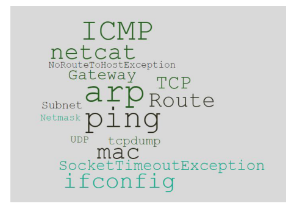
	- 上图中知识点的作用在 RFC1180[1] 中讲得无比通俗易懂了。看第一遍的时候也许你就看懂了，但是一个月后又忘记了。其实这些东西我们在大学也学过，但还是忘了（能够理解，缺少实操环境和条件），或者碰到问题才发现之前看懂了的东西其实没懂。
	- 所以接下来我们将示范书本知识到实践的贯通过程，希望把网络概念之间的联系通过实践来组织起来。
1. 还是从一个问题入手
	- 最近的环境碰到一个网络 ping 不通的问题，当时的网络链路是（大概是这样，略有简化）：
1. 现象
	- ● 从容器 1 ping 物理机 2 不通；
	- ● 从物理机 1 上的容器 2 ping 物理机 2 通；
	- ● 同时发现即使是通的，有的容器 ping 物理机 1 只需要 0.1ms，有的容器需要200ms 以上（都在同一个物理机上），不合理；
	- ● 所有容器 ping 其它外网 IP（比如百度）反而是通的。
	- 这个问题扯了一周才解决是因为容器的网络是我们自己配置的，交换机我们没有权限接触，由客户配置。出问题的时候都会觉得自己没问题对方有问题，另外就是对网络基本知识认识不够，所以都觉得自己没问题而不去找证据。
	- 这个问题的答案在大家看完本文的基础知识后会总结出来。
	- 解决这个问题前大家先想想，假如有个面试题是：输入 ping IP 后敲回车，然后发生了什么？
1. 复习一下大学课本中的知识点
	- 要解决一个问题你首先要有基础知识，在知识欠缺的情况下就算逻辑再好、思路再清晰、智商再高，也不一定有效。
	- route 路由表
	- 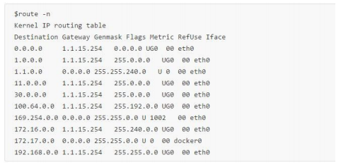
	- 假如你在这台机器上 ping 172.17.0.2 ，根据上面的 route 表得出 172.17.0.2这个 IP 符合下面这条路由：
	- 172.17.0.0		0.0.0.0		255.255.0.0		u		0		00		docker0
	- 这条路由规则，那么 ping 包会从 docker0 这张网卡发出去。
	- 但是如果是 ping 1.1.4.4 根据路由规则就应该走 eth0 这张网卡而不是 docker0了。接下来就要判断目标 IP 是否在同一个子网了。
	- ifconfig
	- 首先来看看这台机器的网卡情况：
	- 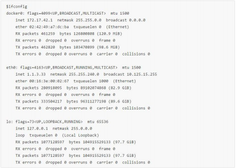
	- 这里有三个网卡和三个 IP，三个子网掩码（netmask)。根据目标路由走哪张网卡，得到这个网卡的子网掩码，来计算目标 IP 是否在这个子网内。
	- arp 协议
	- 网络包在物理层传输的时候依赖的 mac 地址而不是上面的 IP 地址，也就是根据mac 地址来决定把包发到哪里去。
	- arp 协议就是查询某个 IP 地址的 mac 地址是多少，由于这种对应关系一般不太变化，所以每个 os 都有一份 arp 缓存（一般 15 分钟过期），也可以手工清理，下面是 arp 缓存的内容：
	- 
1. 进入正题，回车后发生什么？
	- 有了上面的基础知识打底，我们来思考一下 ping IP 到底发生了什么。
	- 首 先 OS 的 协 议 栈 需 要 把 ping 命 令 封 成 一 个 icmp 包， 要 填 上 包 头（包 括src-IP、mac 地址），那么 OS 先根据目标 IP 和本机的 route 规则计算使用哪个interface( 网卡），确定了路由也就基本上知道发送包的 src-ip 和 src-mac 了。每条路由规则基本都包含目标 IP 范围、网关、MAC 地址、网卡这样几个基本元素。
	- 如果目标 IP 和本机使用的 IP 在同一子网
	- 如 果 目 标 IP 和 本 机 IP 是 同 一 个 子 网（根 据 本 机 ifconfig 上 的 每 个 网 卡 的netmask 来判断是否是同一个子网——知识点：子网掩码的作用），并且本机 arp 缓存没有这条 IP 对应的 mac 记录，那么给整个子网的所有机器广播发送一个 arp 查询，比如我 ping 1.1.3.42，然后 tcpdump 抓包首先看到的是一个 arp 请求：
	- 
	- 上面就是本机发送广播消息，1.1.3.42 的 mac 地址是多少？很快 1.1.3.42 回复了自己的 mac 地址。 收到这个回复后，先缓存起来，下个 ping 包就不需要再次发 arp 广播了。 然后将这个 mac 地址填写到 ping 包的包头的目标 Mac（icmp 包），然后发出这个 icmp request 包，按照 mac 地址，正确到达目标机器，然后对方正确回复 icmp reply（对方回复也要查路由规则，arp 查发送方的 mac，这样回包才能正确路由回来，略过）。
	- 来看一次完整的 ping 1.1.3.43，tcpdump 抓包结果：
	- 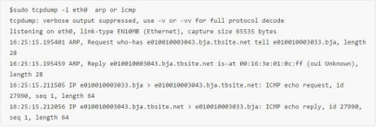
	- 我换了个 IP 地址，接着再 ping 同一个 IP 地址，arp 有缓存了就看不到 arp 广播查询过程了。
	- 如果目标 IP 不是同一个子网
	- arp 只是同一子网广播查询，如果目标 IP 不是同一子网的话就要经过本 IP 网关进行转发 ( 知识点：网关的作用 )。如果本机没有缓存网关 mac（一般肯定缓存了），那么先发送一次 arp 查询网关的 mac，然后流程跟上面一样，只是这个 icmp 包发到网关上去了（mac 地址填写的是网关的 mac）。
	- 从本机 1.1.3.33 ping 11.239.161.60 的过程，因为不是同一子网按照路由规则匹配，根据 route 表应该走 1.1.15.254 这个网关，如下截图：
	- 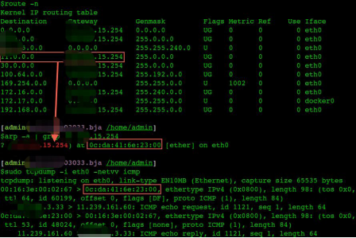
	- 首先是目标 IP 11.239.161.60 符合最上面红框中的路由规则，又不是同一子网，所以查找路由规则中的网关 1.1.15.254 的 Mac 地址，arp cache 中有，于是将 0c:da:41:6e:23:00 填入包头，那么这个 icmp request 包就发到 1.1.15.254 上了，虽然包头的 mac 是 0c:da:41:6e:23:00，但是 IP 还是 11.239.161.60。
	- 看看目标 IP 11.239.161.60 真正的 mac 信息（跟 ping 包包头的 Mac 是不同的）：
	- 
	- 这个包根据 Mac 地址路由到了网关上。
1. 网关接下来怎么办？
	- 为了简化问题，假设两个网关直连
	- 网 关 收 到 这 个 包 后（因 为 mac 地 址 是 它 的）， 打 开 一 看 IP 地 址 是 11.239.161.60， 不 是 自 己 的， 于 是 继 续 查 自 己 的 route 和 arp 缓 存， 发 现11.239.161.60 这个 IP 的网关是 11.239.163.247，于是把包的目的 mac 地址改成11.239.163.247 的 mac 继续发出去。
	- 11.239.163.247 这个网关收到包后，一看 11.239.161.60 是自己同一子网的IP，于是该 arp 广播找 mac 就广播，cache 有就拿 cache 的，然后这个包才最终到达目的 11.239.161.60 上。
	- 整个过程中目标 mac 地址每一跳都在变，IP 地址不变，每经过一次 MAC 变化可以简单理解成一跳。
	- 实际上可能要经过多个网关多次跳跃才能真正到达目标机器。
	- 目标机器收到这个 icmp 包后的回复过程一样，略过。
	- arp 广播风暴和 arp 欺骗
	- 广播风暴：如果一个子网非常大，机器非常多，每次 arp 查询都是广播的话，也容易因为 N*N 的问题导致广播风暴。
	- arp 欺骗：同样如果一个子网中的某台机器冒充网关或者其他机器，当收到 arp广播查询的时候总是把自己的 mac 冒充目标机器的 mac 发给你，然后你的包先走到他，再转发给真正的网关或者目标机器，所以在里面动点什么手脚，看看你发送的内容都还是很容易的。
1. 讲完基础知识再来看开篇问题的答案
	- 读完上面的基础知识相信现在我们已经能够回答 ping IP 后发生了什么。这些已经足够解决 99% 的程序员日常网络中网络为什么不通的问题了。但是前面的问题比这个要稍微复杂一点，还是依靠这些基础知识就能解决——这是基础知识的威力。
	- 现场网络同学所做的一些其它测试：
	- 怀疑不通的 IP 所使用的 mac 地址冲突，在交换机上清理了交换机的 arp 缓存，没有帮助，还是不通；
	- 新拿出一台物理机配置上不通的容器的 IP，这是通的，所以负责网络的同学坚持是容器网络的配置导致了问题。
	- 对于 1 能通，我认为这个测试不严格，新物理机所用的 mac 不一样，并且所接的交换机口也不一样，影响了测试结果。
	- 祭出万能手段——抓包
	- 抓包在网络问题中是万能的，但是第一次容易被 tcpdump 抓包命令的众多参数吓晕，不去操作你永远上不了手，差距也就拉开了，你看差距有时候只是你对一条命令的执行。
	- 在物理机 2 上抓包：
	- 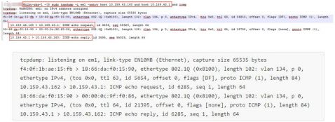
	- 这个抓包能看到核心证据，ping 包有到达物理机 2，同时物理机 2 也正确回复了（mac、ip 都对）。
	- 同时在物理机 1 上抓包（抓包截图略掉）只能看到 ping 包出去，回包没有到物理机 1（所以回包肯定不会回到容器里了）。
	- 到这里问题的核心在交换机没有正确地把物理机 2 的回包送到物理机 1 上面，同时观察到的不正常延时都在网关那一跳：
	- 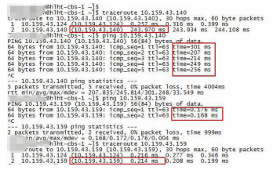
	- 最终的原因
	- 最后在交换机上分析包没正确发到物理机 1 上的原因跟客户交换机使用了 HSRP（热备份路由器协议，就是多个交换机 HA 高可用，也就是同一子网可以有多个网关的IP），停掉 HSRP 后所有 IP 容器都能通了，并且前面的某些容器延时也恢复正常了。
	- 通俗点说就是 HSRP 把回包拐跑了，有些回包拐跑了又送回来了（延时200ms 那些）至于 HSRP 为什么会这么做，要厂家出来解释了。这里关键在于能让客户认同问题出现在交换机上还是前面的抓包证据充分，无可辩驳。实际中我们都习惯不给证据就说：我的程序没问题，就是你的问题。这样表述没有一点意义，我们是要拿着证据这么说，对方也好就着证据来反驳，这叫优雅地甩锅。
1. 网络到底通不通是个复杂的问题吗？
	- 讲这个过程的核心目的是除了真正的网络不通，有些是服务不可用了也怪网络。很多现场的同学根本讲不清自己的服务（比如 80 端口上的 tomcat 服务）还在不在，网络通不通，是网络不通呢还是服务出了问题。一看到 SocketTimeoutException 就想把网络同学抓过来羞辱两句：网络不通了，网络抖动导致我的程序异常了（网络抖动是个万能的扛包侠）。
	- 实际这里涉及到四个节点（以两个网关直连为例），srcIP -> src 网关 -> dest网关 -> destIP。如果 ping 不通 ( 也有特殊的防火墙限制 ping 包不让过的），那么在这四段中分段 ping（二分查找程序员应该最熟悉了）。 比如前面的例子就是网关没有把包转发回来。
	- 抓包看 ping 包有没有出去，对方抓包看有没有收到，收到后有没有回复。
	- ping 自己网关能不能通，ping 对方网关能不能通。
1. 接下来说点跟程序员日常相关的
	- 如果网络能 ping 通，服务无法访问
	- 那么尝试 telnet IP port 看看你的服务是否还在监听端口，在的话再看看服务进程是否能正常响应新的请求。有时候是进程死掉了，端口也没人监听了；有时候是进程还在但是假死了，所以端口也不响应新的请求了，还有的是 TCP 连接队列满了不能响应新的连接。
	- 如果端口还在也是正常的话，telnet 应该是好的：
	- 
	- 假如我故意换成一个不存在的端口，目标机器上的 OS 直接就拒绝了这个连接（抓包的话一般是看到 reset 标识）：
	- 
	- 一个 SocketTimeoutException，程序员首先怀疑网络丢包的 Case
	- 当时的反馈应用代码抛 SocketTimeoutException，怀疑网络问题：
		- 业务应用连接 Server 偶尔会出现超时异常；
		- 业务很多这样的异常日志：[Server SocketTimeoutException]
	- 检查一下当时的网络状态非常好，出问题时间段的网卡的量信息也非常正常：
	- 
	- 上图是通过 sar 监控到的 9 号 v24d9e0f23d40 这个网卡的流量，看起来也是正常，流量没有出现明显的波动。
	- 为了监控网络到底有没有问题，接着在出问题的两个容器上各启动一个 http server，然后在对方每 1 秒钟互相发一次发 http get 请求访问这个 http server，基本认识告诉我们如果网络丢包、卡顿严重，那么我这个 http server 的监控日志时间戳也会跳跃，如果应用是因为网络出现异常那么我启动的 http 服务也会出现异常——宁愿写个工具都不背锅（主要是背了锅也不一定能解决掉问题）。
	- 从实际监控来看，应用出现异常的时候我的 http 服务是正常的（写了脚本判断日志的连续性）：
	- 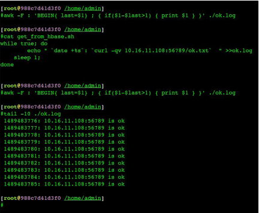
	- 这也强有力地证明了网络没问题，所以写业务代码的同学一门心思集中火力查看应用的问题。后来的实际调查发现是应用假死掉了（内部线程太多，卡死了），服务端口不响应请求了。
	- 如果基础知识缺乏一点那么甩过来的这个锅网络是扛不动的，同时也阻碍了问题的真正发现。
	- TCP 协议通讯过程跟前面 ping 一样，只是把 ping 的 icmp 协议换成 TCP 协议，也是要先根据 route，然后 arp。
	- 总结
	- 网络丢包、卡顿、抖动很容易做扛包侠，只有找到真正的原因解决问题才会更快，否则在错误的方向上怎么发力都不对。准确的方向要靠好的基础知识和正确的逻辑以及证据来支撑，而不是猜测。
		- ● 基础知识是决定你能否干到退休的关键因素；
		- ● 有了基础知识不代表你能真正转化成生产力；
		- ● 越是基础，越是几十年不变的基础越是重要；
		- ● 知识到灵活运用要靠实践，同时才能把知识之间的联系建立起来；
		- ● 简而言之缺的是融会贯通和运用；
		- ● 做一个有礼有节的甩包侠；
		- ● 在别人不给证据愚昧甩包的情况下你的机会就来了。
	- 留几个小问题：
		- server 回复 client 的时候是如何确定回复包中的 src-ip 和 dest-mac 的？一定是请求包中的 dest-ip 当成 src-ip 吗？
		- 上面问题中如果是 TCP 或者 UDP 协议，他们回复包中的 src-ip 和 dest-mac 获取会不一样吗？
		- 既然局域网中都是依赖 Mac 地址来定位，那么 IP 的作用又是什么呢？
1. 参考资料：
	- [1] https://tools.ietf.org/html/rfc1180
	- [2] https://tools.ietf.org/html/rfc1180
	- 《计算机基础》
#### 阿里资深技术专家的 10 年感悟
作者：无相　资深技术专家
阿里妹导读：阿里有许多土话，比如“方法总比困难多”、“不淘汰自己就会被别人淘汰”、“你感觉不舒服的时候，就是成长的时候”。每一句都在激励我们向前。生活总不缺困难和磨练，痛苦的时候，只有转变思维，才能蜕变。今天，阿里巴巴资深技术专家无相分享他在阿里这 10 年来的几点感悟。今天很残酷，明天更残酷，后天很美好，熬过明天晚上，才能看到后天的太阳。
2019 年的上半年，我密集地写了 tbbpm idea 插件，终于比较圆满地解决 idea 插件的开发问题。经过这件事，内心有股强烈的冲动，促使我写下这些年面对痛苦时，我的一些解决问题的方法和感悟。
1. 一个人走得快，一群人走得远
	- “一个人走得快，一群人走得远”，这句话是阿里的土话。没有这些年的编程经历，不会深刻地感受这句话背后逻辑与力量。一个人持续做一件工作量较大且较长期的事情时，对心力的考验是很大的。当多人协同时，心力压力能够得到很大的缓解。
	- Knowledge is commonly socially constructed, through collaborative efforts toward shared objectives or by dialogues and challenges brought about by differences in persons’ perspectives.
	- Salomon
	- 《The Costs and Benefits of Pair Programming》这篇论文的研究表明：结对编程能够改进设计质量，减少代码缺陷（代码行数减少，测试通过率更高），减少员工离职风险，提升软件技能。团队解决问题的速度变快，同时更加愿意坐到一起工作。
2. 当你不舒服，难受或陷于困境时，应该停下来思考
	- 在写 tbbpm idea 插件时，我花了三年（准确来说是 3 个春节）才写成，idea 的设计插件在业界无参考标准，不能很好地快速进行。记得在 eclipse tbbpm 插件时，因有业界源码参考，用了两个通宵原型就做出来了。Tbbpm 是一个闲暇时间的产物，只能利用春节这样的大长假才能开发。我希望自己能够在极短的时间内完成，然而，第一个春节与第二个春节都没有成功。在第三个春节时，关键的拖拽依然没有很好的搞定，心力已经接近憔悴。屡次失败之后，我不得不开始反思，是不是我做这件事的方式错了？是不是我的欲望已经超越了我当前的能力。
	- 于是，那时候我停下手头的工作，冷静的地思考了 2 天。
	- 这里举个当时的例子，idea 插件绘制表单的困境：因为用 swing 的方式来构建流程时，使用很多原生的库、GUI、JformBuilder，觉得画一个表单很困难， 尽管有些产品商已经用了，依然非常难用。静下来思考后，通过 google，找到了 miglayout 这个库，问题才得以解决。
	- 困境是个人成长的最好机会，放弃、逃避、拒绝思考，就意味着放弃成长。如果遇到困境不自知，不解决，则会出现昨日所不知不能者，今日仍是不知不能；去年所不知不能者，今年仍是不知不能。
	- 同时，最近有很多同学向我反馈，遇到困境时，通过个人的努力依然不能突破。这种情况下，可以尝试另外一条路，像《能力陷阱》这本书所说的一样，可以引入外部的力量。
3. 学习能力与思维模式是一个人的核心竞争力
- 没有自学能力的人没有未来。李笑来
- 首先承认自己的不足
	- Stay foolish, stay hungry.
	- 我们要承认一个基本的逻辑事实是 : 任何事情不是天生就能精通，要通过训练才能达到优秀的程度。很多事物的判断能力，要是逐步建立的。只有意识到自己的不足，才能觉悟，去学习进步。
	- 网上看到一张图《how to draw a horse》深有感触：
	- 
	- 图片来源：https://oktop.tumblr.com/post/15352780846
	- 这个漫画显示的哲理：有时最后一步，你要付出非常多的努力。任何高水平的技术或思维模式，都需要付出努力，并非生而得来。
- 掌握优秀的学习方法：
	- 如何证明一个人有比较优秀的学习能力？学习做到目到，口到，心到。读书要目到，口到，心到。尔读书不看清这画偏旁，不辩明句读，不记清首尾，是目不到也。喉，舌，唇，牙，齿五间音并不清晰伶俐，蒙笼含糊，听不明白，或多几字，或少几字，只图混过就是，是口不到也。经传精义奥皆初学固不能通，至于大略粗解原易明白，稍肯用心体会，一字求一字下落，一句求一句道理，一事求一事原委，虚字审其神气，实字测其义理，自然渐有所悟。一时思索不得，即请先生解说，一时尚未融稀，即将上下文或别章别部义理相近者反复推寻，务期了然于心，了解于口，始可放手。总要将此心运在字里行间，时复思绎，乃为心到。
	- 左宗棠 《与孝威孝宽》
	- 当你能完全能用自己的语言准确讲述你所学的知识，知其然，并知其所以然，你才是真正完全的掌握。对于工程师来说，学习要做到目到、口到、心到、手到。
- 掌握搜索信息的有效方式
	- 现代是一个信息非常充分乃至爆炸的信息社会。如何高效获取信息，分析信息是非常重要的能力。相对常规的模式是：当你发现问题，定义出问题，就去搜索业界最优秀的解决方案，并且花时间研究方案，了解原理，最后不断地学习实践。这种方式能够有效保证你对问题的解决方案是相对优秀的解决方案。公司对高层级的同学，必须有业界全局的视眼与思考。
	- 如何提升获取的信息质量，这里有一些建议：
		- ● 精确定位问题
		- ● 梳理出关键字与概念
		- ●“全网”搜索
		- ● 分析研究
		- ● 实践 & 结论 & 假设
- 具备优秀的批判性思维模型
	- 在《批判性思维工具》一书中，对思维的水平分了三个层次：较差、中等、最佳水平的思考（如下图 1）。当前很多同学可能在多数问题上都处于较差水平层次，很多认知来自直觉或者自我视角。最佳水平的思考要做到三点：全局、公正、客观。
	- 
	- 图片来源：《批判性思维工具》
	- 另外，多数人终生停留在鲁莽的思考阶段。鲁莽的思考者，不知道如何确定自己的目的是否清晰，不知道自己的假设是否公正，不知道自己的结论是否符合逻辑。如果没有思考的概念，也就从不会对自己的思维进行反思。
	- 
	- 图片来源：《批判性思维工具》
	- 左宗棠的学习方法与国外的《批判性思维工具》，都在要求我们把自身脑海中不清晰的概念与逻辑梳理清楚，建立满足第一性原理的认知体系与评判标准。幸好在当今互联的信息社会，很多人已经开始这样做了，所以从小就受“填鸭”式教育的我们，更需要奋力精进。
	- 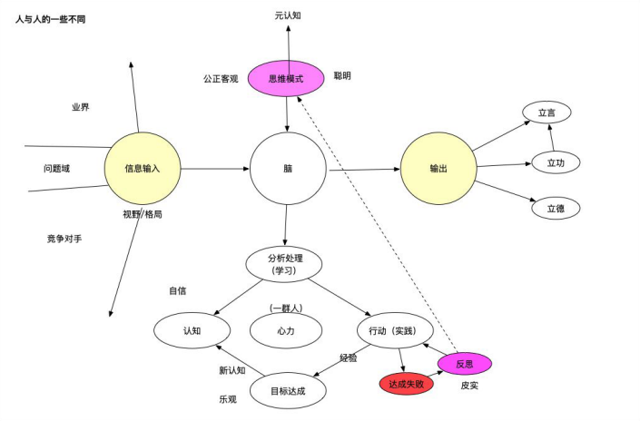
- 参考资料：
	- 结对编程
	- 李笑来的自学
	- 怎么变成一个更好的程序员
	- 找到高质量信息指引
#### 如何量化考核技术人的 KPI ？
- 作者： 张建飞　高级技术专家
- 阿里妹导读：对技术人来说，技术是成长的“核心”。然而，在实际工作协作中，技术的重要性常常被业务所掩盖，造成先业务后技术的现象。
- 针对这个痛点，阿里高级技术专家张建飞提出了自己的解决思路，希望能与大家一起探讨、交流。
1. 为什么需要技术 KPI ？
	- 在业务技术团队，有一个不好的趋势就是团队越来越业务，越来越没有技术味道。每个人都在谈业务，技术大会上在谈业务，周会上在聊业务，周报里写的是业务项目……
	- 唯独少被谈及的是技术本身。此处并不是说业务不重要，而是说理解业务和把控业务需求是技术人员的 base，而不是全部。
	- **将就的代价**
	- 这种技术味道的缺失对技术团队来说是非常可惜的，也不利于技术人员的成长和发展。因为很难想象一个没有技术追求的团队能开发出一个健壮的、可维护性好、可扩展性好的系统。相反，这种业务代码的堆砌，从短期看也许是“较快”实现了业务需求，但是从长远来看，这种烂系统的增加会极大的阻碍业务的发展，形成一个个的黑洞应用，而工程师被裹挟在业务需求和烂系统之间，疲于应对，心力交瘁。
	- 这种将就将导致系统腐化，技术债越垒越高，像肿瘤一样消耗你所有的能量。
	- 我不是药神，只能尝试开出一方——那就是在不影响业务的情况下（特别是相对稳定的业务，请拒绝业务方的时间倒排），Tech Story 应该和 User Story 有同等的重要性，要把重构优化提到和业务需求相等的优先级去处理。我们不仅要对业务需求负责，我们更要对应用的质量，系统的可维护性负责。
	- 因为我们技术人员是应用的父母（有些是亲生父母，有些是养父母），你不照顾它们，不治理它们，它们就会生病，你忍心看到这样的局面吗？
	- **技术管理者者（TL）的失职**
	- 造成这种局面，我们的技术管理者，我们的 TL 要负有主要责任。如果一个 TL从来不关注系统架构和设计，从来不写 code，对技术没有热情也不学习，甚至其本身技术就很烂，那么在这个 TL 领导下的技术团队，又怎么会有技术味道，团队成员又怎么能进步和成长？
	- 现在很多的 TL 每天都混迹在各种会议上，很忙，做着各种沟通协调的事情，可是我们真的需要这么多的会议、这么多的沟通吗？
	- 如果沟通的结果只是做业务和 PD 对团队的传话筒，没有业务创新，没有用技术和数据系统化的解决业务问题，没有在技术方向和架构上给团队指引，没能切实的帮助系统优化、团队提效，请问这样的沟通给业务带来了什么价值，给团队带来了什么价值？还是沉下心来，多看看书，哪怕非技术的书也好。多写写代码，哪怕跟业务无关的代码也好。
	- 所以，我们要回归技术本身。我们不需要这么多“高高在上”、“指点江山”的技术 Manager，而是需要能真正深入到系统里面，深入到代码细节，给团队带来实实在在改变的技术 Leader。
1. 技术 KPI 的量化
	- 提升技术氛围，打造工程师文化不能仅停留在口头上，可搭配一定的强制手段，比如和技术人员的利益绑定。这种绑定就需要我们能对技术贡献进行一个相对公平的分解和量化。
	- **技术 KPI**
	- 基于此，我将技术人员的 KPI 分解为业务贡献、技术贡献和团队贡献三个大的部分，其详细内容如下。
		- ● 业务贡献：包括需求把控，业务项目和业务创新。
		- ● 技术贡献：包括设计重构、技术影响力、Code Review、创新提效和代码质量。
		- ● 团队贡献：包括招聘、新人培养和团队氛围。
	- 那么技术贡献中的这几个维度要怎么理解呢，解释的话我就不多说了，用我们工作中的一些案例来描述一下吧。
	- 应用质量：
		- 你负责或者共同负责的应用质量分（可以从代码重复率，圈复杂度，分层合理性等维度考察）。
		- 你做了哪些提升应用质量分的工作。
	- 设计重构：
		- 我在客户通项目中，对 CRM 销售域进行了领域建模和设计，并且抽象合理。
		- 我发现 Infrastructure 中 package 分类不合理，进行了重新设计并重构完成。
		- 我发现现在系统中错误码比较混乱，我梳理制定了新的错误码规范，并完成了代码重构。
	- 技术影响力：
		- 在团队内分享 10 篇干货，点赞数 1000。
		- 团队分享策略模式，得到同学好评 。
		- 我接受邀请，在行业会议上分享了 SOFA 架构。
	- Code Review：
		- 我在 review 某某代码的时候发现，可能存在线程不安全的隐患。
		- 我在 review 某某代码的时候发现，存在设计不合理的现象，此处使用责任链可以很优雅的解决问题，并具备一定的扩展性。
	- 创新提效：
		- 我发现本地测试启动 PandoraBoot 比较浪费时间，所以写了一个 TestCon￾tainer 大大提升了自测效率。
		- 我 发 现 有 一 些 boilerplate 代 码 不 需 要 写， 所 以 对 乐 观 锁、 分 页 进 行 了annotation 支持，简化了代码。
		- 在某个项目或者技术点上面，我产出了一篇专利：基于领域模型的业务配置化。
	- 代码质量：
		- 提测后的 Bug 数，线上故障数（系统可以提取，不用自己填写）
		- 我完善了某某模块的单元测试，并多次在自动化回归中发现问题。
	- **KPI答疑**
	- 对于上面的 KPI 大部分的技术同学是表示认可的，当然质疑的声音也很多，我这里挑一些典型的回答一下。
	- Q：技术 KPI 的提出，会不会导致技术同学只关注技术不做业务项目了？
	- A：关于绩效，肯定是综合看业务贡献，技术贡献和团队贡献。但是作为一个重要参考和风向标，技术 KPI 是有积极意义的。
	- Q：你这个设计重构怎么量化？
	- A：这个很难用系统标准化，更多的还是要依赖 TL 的专业能力进行评分，但即使是这样，也比以前什么都没有完全黑盒要强。至少在传达一个信息，我们鼓励好的设计，鼓励不断地重构优化。
	- Q：我们现在的业务需求已经在堆积，一线同学根本没有时间去做重构优化。
	- A：这个问题开篇其实已经说过了，你是要不断地裹挟在业务需求和烂代码里面呢，还是花时间 improve，然后更快地支持业务。这个权衡应该不难做，关键是要看决心和能力。对于很多业务，我没有看到推迟几天上线就会影响业务格局的业务场景，所以作为技术团队，我们就应该在 User Story 之外，加上我们的 Technical Story，把完成业务需求和系统重构都当成我们的核心任务。
#### 如何成为优秀的技术主管？你要做到这三点
- 作者：云狄　高级技术专家
- 阿里妹导读：技术主管，又叫「技术经理」，英文一般是 Tech Leader ，简称 TL。随着工作经验的不断积累，能力的不断提升，每个人都有机会成为 Team Leader。然而在机会到来前，我们必须提前做好准备，对 TL 的工作职责有一定了解。当然，这也会为当下更好地配合 TL 工作打下基础。
- 阿里巴巴高级技术专家云狄将结合自己多年的经验，从开发规范、开发流程、技术规划与管理三个角度出发，分享对技术 TL 这一角色的理解与思考。
- 「技术主管」是开发团队中的某位程序员需要对一起创建系统的整个开发团队负责时所承担的角色。通常他既要对最终交付的软件系统负责，另外也会像一个程序员一样去开发实现系统。
- 一个技术主管的 60% ～ 70% 的时间可能花在了开发任务分解分配、开发实践、技术架构评审、代码审核和风险识别上，而余下的 30% ～ 40% 的时间则花在为了保障系统按时交付所需的各种计划、协作、沟通、管理上。和团队管理者不同的是，技术主管的大部分管理工作都是针对具体研发任务和技术事务的。
- 接下来基于我在技术 TL 这个角色上，在开发规范、开发流程、技术管理与规划等方面我的一些心路历程，和大家共勉。
1. 开发规范
	- 我当时负责的业务是集团收购一家子公司的业务，在整体技术标规范上与集团的技术标准存在很大的差异。开发规范可以说是我来到这个团队干的第一件事，我当时面对的问题是 API 接口格式混乱，没有标准的 RPC 服务化，代码没有统一标准的开发规范，技术框架组件非标准化等一系列问题，作为一名业务上的新人，我第一时间制定了一套相对标准、全面的技术开发规范，边写代码边梳理开发规范，引领团队走向统一标准化开发道路。
	- 针对团队研发规范暴露的上述问题，主要制定了如下规范：
	- **命名规范**
	- 我自己非常注重搭建项目结构的起步过程，应用命名规范、模块的划分、目录（包）的命名，我觉得非常重要，如果做的足够好，别人导入项目后可能只需要 10 分钟就可以大概了解系统结构。
	- 具体规范包括包命名、类的命名、接口命名、方法命名、变量命名、常量命名。
	- **统一 IDE 代码模板**
	- 约定了 IDEA/Eclipse IDE 代码的统一模板，代码风格一定要统一，避免不同开发人员使用不同模板带来的差异化以及代码 merge 成本。使用 IDEA 的同学可以安装 Eclipse Code Formatter 插件，和 Eclipse 统一代码模板。
	- **Maven 使用规范**
	- 所有二方库、三方库的版本统一定义到 parent pom 里，这样来所有业务应用工程统一继承 parent pom 里所指定的二方库、三方库的版本，统一框架与工具的版本(Spring、Apache commons 工具类、日志组件、JSON 处理、数据库连接池等 )，同时要求生产环境禁用 SNAPSHOT 版本。这样以来升级通用框架与工具的版本，只需要应用工程升级 parent pom 即可。
	- **代码 Commit 规范**
	- 基于 Angular Commit Message 规范生成统一的 ChangeLog，这样一来对于每次发布 release tag 非常清晰，Mac 下都需要安装对应的插件，IDEA 也有对应的插件，具体可以参考阮一峰老师的《Commit message 和 Change log 编写指南》。
	- 此刻忽然想起 Linus 面对 pull request 里的骚操作所发的飚：
	- Get rid of it. And I don’t ever want to see that shit again. ——Linus
	- 代码的 commit 的规范对团队非常重要，清晰的 commit 信息生成的 release tag，对于生产环境的故障回滚业非常关键，能够提供一些有价值的信息。
	- **统一 API 规范**
	- 统一 Rpc 服务接口的返回值 ResultDTO, 具体代码如下：
	- 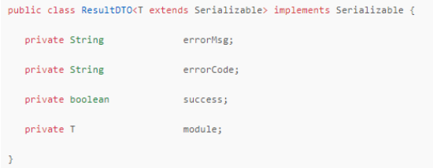
	- success 代 表 接 口 处 理 响 应 结 果 成 功 还 是 失 败，errorCode、errorMsg 表示 返 回 错 误 码 和 错 误 消 息，module 表 示 返 回 结 果 集， 把 ResultDTO 定 义 到common-api 顶层二方库，这样以来各个应用不需要来回转换返回结果。
	- Http Rest 接口规范约定同 ResultDTO 相差无几，需要额外关注一下加解密规范和签名规范、版本管理规范。
	- **异常处理规范**
	- 异常处理不仅仅是狭义上遇到了 Exception 怎么去处理，还有各种业务逻辑遇到错误的时候我们怎么去处理。service 服务层捕获的异常主要包括 BusinessException( 业务异常 )、RetriableException ( 可重试异常 ) 到 common-api，定义一个公共异常拦截器，对业务异常、重试异常进行统一处理，对于可重试的异常调用的服务接口需要保证其幂等性。
	- 另外其他业务层有些特殊异常不需要拦截器统一处理，内部可以进行自我消化处理掉，根据场景对应的处理原则主要包括：
		- ● 直接返回
		- ● 抛出异常
		- ● 重试处理
		- ● 熔断处理
		- ● 降级处理
	- 这又涉及到了弹力设计的话题，我们的系统往往会对接各种依赖外部服务、Api，大部分服务都不会有 SLA，即使有在大并发下我们也需要考虑外部服务不可用对自己的影响，会不会把自己拖死。我们总是希望：
		- ● 尽可能以小的代价通过尝试让业务可以完成；
		- ● 如果外部服务基本不可用，而我们又同步调用外部服务的话，我们需要进行自我保护直接熔断，否则在持续的并发的情况下自己就会垮了；
		- ● 如果外部服务特别重要，我们往往会考虑引入多个同类型的服务，根据价格、服务标准做路由，在出现问题的时候自动降级。
	- 推荐使用 Netflix 开源的 hystrix 容灾框架，主要解决当外部依赖出现故障时拖垮业务系统、甚至引起雪崩的问题。目前我团队也在使用，能够很好的解决异常熔断、超时熔断、基于并发数限流熔断的降级处理。
	- **分支开发规范**
	- 早期的时候源码的版本管理基于 svn，后来逐步切换到 git，分支如何管理每一个公司（在 Gitflow 的基础上）都会略有不同。
	- 针对分支开发规范，指定如下标准：
		- ● 分支的定义（master、develop、release、hotfix、feature）
		- ● 分支命名规范
		- ● checkout、merge request 流程
		- ● 提测流程
		- ● 上线流程
		- ● Hotfix 流程
	- 虽然这个和代码质量和架构无关，按照这一套标准执行下来，能够给整个研发团队带领很大的便利：
		- ● 减少甚至杜绝代码管理导致的线上事故；
		- ● 提高开发和测试的工作效率，人多也乱；
		- ● 减少甚至杜绝代码管理导致的线上事故；
		- ● 方便运维处理发布和回滚；
		- ● 让项目的开发可以灵活适应多变的需求，多人协同开发。
	- **统一日志规范**
	- 日志是产品必不可少的一个功能，具备可回溯性、能够抓取问题现场信息是其独一无二的优点，尤其在生产系统上问题定位等方面具有不可替代的作用。
	- 这里着重强调一下针对异常的日志规范：
		- ● WARN 和 ERROR 的选择需要好好考虑，WARN 一般我倾向于记录可自恢复但值得关注的错误，ERROR 代表了不能自己恢复的错误。对于业务处理遇到问题用 ERROR 不合理，对于 catch 到了异常也不是全用 ERROR。
		- ● 记录哪些信息，最好打印一定的上下文（链路 TraceId、用户 Id、订单 Id、外部传来的关键数据）而不仅仅是打印线程栈。
		- ● 记录了上下问信息，是否要考虑日志脱敏问题？可以在框架层面实现，比如自定义实现 logback 的 ClassicConverter。
	- 正确合理的使用日志，能够指引开发人员快速查找错误、定位问题，因此约定了一套日志使用标准规范，现在可以更多的参考《阿里经济体开发规约——日志规约》。
	- **统一 MYSQL 开发规范**
	- 表的设计和 Api 的定义类似，属于那种开头没有开好，以后改变需要花 10x 代价的，我知道，一开始在业务不明确的情况下，设计出良好的一步到位的表结构很困难，但是至少我们可以做的是有一个好的标准。
	- **统一工具与框架**
	- 对开发过程中所用到的公共组件进行了统一抽象与封装，包括 dao 层框架mybatis、cache 组件 jetcache、httpclien t 组件、common-tools ( 公共工具 )，同时抽取出全局唯一 ID、分布式锁、幂等等公共组件，把以上公共组件进行集成到各个应用，进行统一升级、维护，这样以来方便大家将更多的精力集中到业务开发上。
1. 开发流程
	- 目前团队的开发模式还是基于传统的瀑布开发模式，整体开发流程涉及需求评审、测试用例评审、技术架构评审、开发与测试、验收与上线，这里主要基于 TL 的角度从需求管理、技术架构评审、代码评审、发布计划评审几个关键重点环节进行探讨，欢迎拍砖。
	- **需求管理**
	- 美国专门从事跟踪 IT 项目成功或失败的权威机构 Standish Group 的 CHAOS Reports 报导了该公司的一项研究，该公司对多个项目作调查后发现，百分之七十四的项目是失败的，既这些项目不能按时按预算完成。其中提到最多的导致项目失败的原因就是”变更用户需求”。另外从历年的 Standish Group 报告分析看，导致项目失败的最重要原因与需求有关。Standish Group 的 CHAOS 报告进一步证实了与成功项目最密切的因素是良好的需求管理，也就是项目的范围管理，特别是管理好项目的变更。
	- 产品因需求而生，在产品的整个生命周期中，产品经理会收到来自各个方面的需求，但是每一个需求的必要性、重要性和实现成本都需要经过深思熟虑的分析和计划，避免盲目的决定需求或者变更需求，这样很容易导致工作混乱，技术 TL 如果不能正确的对需求进行把控，会导致整个项目偏离正确的轨道。
	- 需求管理的第一步就是要梳理不同来源的需求，主要包括从产品定位出发、外部用户反馈、竞争对手情况、市场变化以及内部运营人员、客服人员、开发人员的反馈。首先技术 TL 对产品有足够认知和把控，简单来说就是我的产品是为了满足哪些人的哪些需求而做，产品需求一定要根植于客户的需求、根植于客户的环境。每款产品必定有其核心价值，能够为客户创造更多的价值，基于此考虑往往能得到一些核心需求，摒除价值不大的需求。
	- 需求管理中最重要的就是对发散性需求的管理，往往因此也会导致产品在执行过程中不断的变更或增加需求。由于人的思维是发散性的，所以往往在产品构思的过程中会出现各种新鲜好玩的想法，这些想法可能来自领导或者产品经理自己，但是这些想法往往都是和产品核心方向不相关的，但是由于这些想法能够在当时带来诱惑，因此这些不相关的需求会严重干扰了技术团队的精力，打乱或者延误产品原本的计划。同样技术研发同学也需要建立对产品的深度思考，不要把自己定位成产品需求的实现者，同样需要对需求负责。
	- 很多时候需求的变更或增加是因为我们面临太多选择和想要的太多，没有适当的控制自己的欲望，并以自己的喜好来决定需求，这些因素很容易导致产品没有明确的方向、团队成员疲于奔命，但是却没有实际的成果。所以技术 TL 一定要能够评估出重新审视产品和筛选需求的优先级，识别每一个需求的必要性、重要性和实现成本。通过深思熟虑给团队明确方向并专注，聚焦资源的支配，确保团队的精力都聚焦在产品的核心需求上。
	- **技术架构评审**
	- 互联网时代，大家提倡敏捷迭代，总嫌传统方式太重，流程复杂，影响效率，什么都希望短平快，在扁平化的组织中，经常是需求火速分发到一线研发，然后就靠个人折腾去了，其实技术架构评审这同样是一个非常重要的环节。架构评审或技术方案评审的价值在于集众人的力量大家一起来分析看看方案里是否有坑，方案上线后是否会遇到不可逾越的重大技术问题，提前尽可能把一些事情先考虑到提出质疑其实对项目的健康发展有很大的好处。
	- 基于架构评审，我们的目标核心是要满足以下几点：
		- 设计把关，确保方案合格，各方面都考虑到了，避免缺陷和遗漏，不求方案多牛，至少不犯错。
		- 保证架构设计合理和基本一致，符合整体原则。
		- 维持对系统架构的全局认知，避免黑盒效应。
		- 通过评审发掘创新亮点，推广最佳实践。
	- 架构设计既要保证架构设计的合理性和可扩展性，又要避免过度设计。架构设计不仅仅是考虑功能实现，还有很多非功能需求，以及持续运维所需要的工作，需要工程实践经验，进行平衡和取舍。
	- 架构评审需要以下几点：
		- 技术选型：为什么选用 A 组件不选用 B、C 组件，A 是开源的，开源协议是啥？基于什么语言开发的，出了问题我们自身是否能够维护？性能方面有没有压测过？这些所有问题作为技术选型我们都需要考虑清楚，才能做最终决定。
		- 高性能：产品对应的 TPS、QPS 和 RT 是多少？设计上会做到的 TPS、QPS 和 RT 是多少？而实际上我们整体随着数据量的增大系统性能会不会出现明显问题？随着业务量、数据量的上升，我们的系统的性能如何去进一步提高？系统哪个环节会是最大的瓶颈？是否有抗突发性能压力的能力，大概可以满足多少的 TPS 和 QPS，怎么去做来实现高性能，这些问题都需要我们去思考。
		- 高可用：是否有单点的组件，非单点的组件如何做故障转移？是否考虑过多活的方案？是否有数据丢失的可能性？数据丢失如何恢复？出现系统宕机情况，对业务会造成哪些影响？有无其他补救方案？这些问题需要想清楚，有相应的解决方案。
		- 可扩展性：A 和 B 的业务策略相差无几，后面会不会继续衍生出 C 的业务策略，随着业务的发展哪些环节可以做扩展，如何做扩展？架构设计上需要考虑到业务的可扩展性。
		- 可伸缩性：每个环节的服务是不是无状态的？是否都是可以快速横向扩展的？扩容需要怎么做手动还是自动？扩展后是否可以提高响应速度？这所有的问题都需要我们去思考清楚，并有对应的解决方案。
		- 弹性处理：消息重复消费、接口重复调用对应的服务是否保证幂等？是否考虑了服务降级？哪些业务支持降级？支持自动降级还是手工降级？是否考虑了服务的超时熔断、异常熔断、限流熔断？触发熔断后对客户的影响？服务是否做了隔离，单一服务故障是否影响全局？这些问题统统需要我们想清楚对应的解决方案，才会进一步保证架构设计的合理性。
		- 兼容性：上下游依赖是否梳理过，影响范围多大？怎么进行新老系统替换？新老系统能否来回切换？数据存储是否兼容老的数据处理？如果对你的上下游系统有影响，是否通知到上下游业务方？上下游依赖方进行升级的方案成本如何最小化？这些问题需要有完美的解决方案，稍有不慎会导致故障。
		- 安全性：是否彻底避免 SQL 注入和 XSS ？是否有数据泄露的可能性？是否做了风控策略？接口服务是否有防刷保护机制？数据、功能权限是否做了控制？小二后台系统是否做了日志审计？数据传输是否加密验签？应用代码中是否有明文的 AK/SK、密码？这些安全细节问题需要我们统统考虑清楚，安全问题任何时候都不能轻视。
		- 可测性：测试环境和线上的差异多大？是否可以在线上做压测？线上压测怎么隔离测试数据？是否有测试白名单功能？是否支持部署多套隔离的测试环境？测试黑盒白盒工作量的比例是怎么样的？新的方案是否非常方便测试，在一定程度也需要考量。
		- 可运维性：系统是否有初始化或预热的环节？数据是否指数级别递增？业务数据是否需要定期归档处理？随着时间的推移如果压力保持不变的话系统需要怎么来巡检和维护？业务运维方面的设计也需要充分考虑到。
		- 监控与报警：对外部依赖的接口是否添加了监控与报警？应用层面系统内部是否有暴露了一些指标作监控和报警？系统层面使用的中间件和存储是否有监控报警？只有充分考虑到各个环节的监控、报警，任何问题会第一时间通知到研发，阻止故障进一步扩散。
	- 其实不同阶段的项目有不同的目标，我们不会在项目起步的时候做 99.99% 的可用性支持百万 QPS 的架构，高效完成项目的业务目标也是架构考虑的因素之一。而且随着项目的发展，随着公司中间件和容器的标准化，很多架构的工作被标准化替代，业务代码需要考虑架构方面伸缩性运维性等等的需求越来越少，慢慢的这些工作都能由架构和运维团队来接。一开始的时候我们可以花一点时间来考虑这些问题，但是不是所有的问题都需要有最终的方案。
	- **代码评审**
	- 代码质量包括功能性代码质量和非功能性代码质量，功能质量大多通过测试能够去发现问题，非功能性代码质量用户不能直接体验到这种质量的好坏，代码质量不好，最直接的“受害者”是开发者或组织自身，因为代码质量好坏直接决定了软件的可维护性成本的高低。代码质量应该更多的应该从可测性，可读性，可理解性，容变性等代码可维护性维度去衡量，其中 CodeReview 是保证代码质量非常重要的一个环节，建立良好的 CodeReview 规范与习惯，对于一个技术团队是一件非常重要核心的事情，没有 CodeReview 的团队没有未来。
	- 每次项目开发自测完成后，通常会组织该小组开发人员集体进行代码 review，代码 review 一般 review 代码质量以及规范方面的问题，另外需要关注的是每一行代码变更是否与本次需求相关，如果存在搭车发布或者代码重构优化，需要自行保证测试通过，否则不予发布。
	- CodeReview 我会重点关注如下事情：
		- 确认代码功能：代码实现的功能满足产品需求，逻辑的严谨和合理性是最基本的要求。同时需要考虑适当的扩展性，在代码的可扩展性和过度设计做出权衡，不编写无用逻辑和一些与代码功能无关的附加代码。
		- 在真正需要某些功能的时候才去实现它，而不是你预见到它将会有用。
		 - —— RonJeffries
		- 编码规范：以集团开发规约、静态代码规约为前提，是否遵守了编码规范，遵循了最佳实践。除了形式上的要求外，更重要的是命名规范。目标是提高代码的可读性，降低代码可维护性成本。
		- 潜在的 BUG：可能在最坏情况下出现问题的代码，包括常见的线程安全、业务逻辑准确性、系统边界范围、参数校验，以及存在安全漏洞 ( 业务鉴权、灰产可利用漏洞 ) 的代码。
		- 文档和注释：过少（缺少必要信息）、过多（没有信息量）、过时的文档或注释，总之文档和注释要与时俱进，与最新代码保持同步。其实很多时候个人觉得良好的变量、函数命名是最好的注释，好的代码胜过注释。
		- 重复代码：当一个项目在不断开发迭代、功能累加的过程中，重复代码的出现几乎是不可避免的，通常可以通过 PMD 工具进行检测。类型体系之外的重复代码处理通常可以封装到对应的 Util 类或者 Helper 类中，类体系之内的重复代码通常可以通过继承、模板模式等方法来解决。
		- 复杂度：代码结构太复杂（如圈复杂度高），难以理解、测试和维护。
		- 监控与报警：基于产品的需求逻辑，需要有些指标来证明业务是正常 work的，如果发生异常需要有监控、报警指标通知研发人员处理，review 业务需求对应的监控与报警指标也是 Code Review 的重点事项。
		- 测试覆盖率：编写单元测试，特别是针对复杂代码的测试覆盖是否足够。
	- 实际上维护单元测试的成本不比开发成本低，这点团队目前做的的不到位。
	- 针对以上每次代码 review 所涉及到的经典案例会统一输出到文档里，大家可以共同学习避免编写出同样的 Ugly Code。
	- **发布计划评审**
	- 涉及到 10 人日以上的项目，必须有明确的发布计划，并组织项目成员统一参加项目发布计划 review，发布计划主要包含如下几点：
		- 明确是否有外部依赖接口，如有请同步协调好业务方；
		- 发布前配置确认包括配置文件、数据库配置、中间件配置等各种配置，尤其各种环境下的差异化配置项；
		- 二方库发布顺序，是否有依赖；
		- 应用发布顺序；
		- 数据库是否有数据变更和订正，以及表结构调整；
		- 回滚计划，必须要有回滚计划，发布出现问题要有紧急回滚策略；
		- 生产环境回归测试重点 Case。
1. 技术规划与管理
	- 我在带技术团队的这些年，对团队一直有一个要求，每周都要做系统健康度巡检，未雨绸缪、晴天修屋顶，避免在极端场景下某些隐藏的 bug 转变成了故障。
	- **系统健康度巡检**
	- 为什么要把系统健康度巡检放到技术管理里，我觉得这是一个非常重要的环节。像传统的航空、电力、汽车行业都要有一定的巡检机制，保障设备系统正常运转，同样软件系统也同样需要巡检机制保障业务健康发展。
	- 随着业务的不断发展，业务量和数据量不断的上涨，系统架构的腐蚀是避免不了的，为了保障系统的健康度，需要不断的考虑对系统架构、性能进行优化。
	- 系统的监控与报警能够一定程度发现系统存在的问题，系统存在的一些隐患需要通过对系统的巡检去发现，如果优化不及时在极端情况会导致故障，巡检粒度建议每周巡检一次自己所负责的业务系统。
	- 系统巡检重点要关注如下几点：
		- ● 系统指标：系统 CPU、负载、内存、网络、磁盘有无异常情况波动，确认是否由发布导致，还是系统调用异常。
		- ● 慢接口：通常 rt 大于 3s 的接口需要重点关注，极端并发场景下容易导致整个系统雪崩。
		- ● 慢查询：MYSQL 慢查询需要重点关注，随着数据量上涨，需要对慢查询进行优化。
		- ● 错误日志：通过错误日志去发现系统隐藏的一些 bug，避免这些 bug 被放大，甚至极端情况下会导致故障。
	- **技术规划**
	- 技术规划通常由团队的 TL 负责，每个财年 TL 需要从大局的角度去思考每个季度的技术优化规划，去偿还技术债，技术债也是有利息的，因为利息的存在，技术债务不及时偿还的话，会在未来呈现出非线性增长，造成始料不及的损失。
	- 这里的技术规划包括如下几点：
		- ● 架构优化：一些结构不良、低内聚高耦合的代码则会使得哪怕是微小的需求变更或功能扩展都无从下手，修改的代价很可能超过了重写的代价。同样系统之间的耦合也需要重点去关注，遵循微服务化的原则，系统也要遵循单一职责原则，对于职责不清晰的系统去做解耦优化，进行一些模块化改造、服务隔离、公用服务抽象。
		- ● 性能优化：基于财年对于业务量、数据量的发展评估，根据目前系统服务的QPS\RT, 需要提前规划对系统性能进行一些升级策略，包括重点关注对一些慢接口、慢查询的优化。
		- ● 弹性与可靠性：系统提供的服务需要保障括数据一致性、幂等、防重攻击，同时也需要从熔断降级、异地多活的角度去考虑存在哪些问题，目前系统的SLA 指标是否能够达到高可用，需要做哪些优化保障系统的高可用。
		- ● 可伸缩：应用服务是否保证无状态，关键节点发生故障能够快速转移、扩容，避免故障扩大化。
1. 总结
	- 大家不知道有没有类似的经历，某个时间段突然一些线上故障频发，各种技术债、业务债被业务方穷追猛打要求还债，如果出现这种现象很大程度这个 TL 已经失位了，这个团队失控了。也曾经有人跟我吐槽他的 TL 把活都分给他们，而 TL 自己什么都不干！这个技术 TL 真的什么都不干？曾经有一段时间我也在思考技术 TL 的核心职责到底是什么？技术 TL 应该具备哪些素质？
	- 首先技术说到底是为业务服务的，除非技术就是业务本身，必须体现它的商业价值。在很多公司里技术研发真的就成了实现其他部门需求的工具，我觉得这样的技术TL 肯定是不合格的。首先它不能影响业务发展，需求提出方会经过很多转化，如果不是不假思索传递需求，整个过程会失真。
	- 第二个，我认为最最重要的是架构设计的能力，可能管理能力还次之。对于管理能力我认为最重要的是对团队的感知能力，因为一旦到了技术 TL 这个级别，不能脱离一线太远，业务细节可以不清楚，大的方向必须要明确。如果没有很细腻的感知能力，很多的决策会有偏差。
	- 如果他不是一个业务架构师，不是一个能给团队指明更好方向的人，他最终会沦为一个需求翻译器，产品经理说怎么做就怎么做。他更多的只是负责保证产品的质量、开发的速度，最终被肢解成一个很琐碎的人。一旦团队上了一定的规模，团队就会从单纯的需求实现走向团队运营，而运营是需要方向的，业务架构就是一个基于运营和数据的一种综合的能力。
	- 关于技术层面，技术 TL 需要具备如下素养：
		- ● 技术视野良好，解决问题能力与架构设计能力出色。
		- 技术 TL 要有良好的技术视野，不需要各种技术都样样精通，但是必须要所有涉猎，有所了解，对各种技术领域的发展趋势，主流非主流技术的应用场景要非常了解。知道在什么场景应用什么技术，业务发展到什么规模应该预先做哪些技术储备。产品架构的设计要有足够的弹性，既能够保证当前开发的高效率，又能够对未来产品架构的演进留出扩展的余地。
		- ● 动手能力要强，学习能力出色。
		- 技术 TL 并不需要自己亲自动手写代码，但是如有必要，自己可以随时动手参与第一线的编码工作，技术 TL 不能长期远离一线工作，自废武功，纸上谈兵。否则长此以往，会对技术的判断产生严重的失误。另外，技术 TL 也应该是一个学习能力非常出色的人，毕竟 IT 行业的技术更新换代速度非常快，如果没有快速学习能力，是没有资格做好技术 TL 的。
		- 技术 TL 除了管人和管事之外，其他还有很多事情要做包括建立团队研发文化、团队人才培养与建设、跨部门协调与沟通等，这样以要求技术 TL 也同时也需要具备良好的沟通和管理能力，以上观点仅是个人的一些思考和观点，仅供参考。
#### 在阿里做了五年技术主管，我有话想说
- 作者：云狄　高级技术专家
- 阿里妹导读：《如何成为优秀的技术主管？》中，阿里巴巴高级技术专家云狄从开发规范、开发流程、技术规划与管理三个角度，分享对技术 TL 的理解与思考。接下来，他将继续深入探讨这一话题，从管理的角度分享技术 TL 的核心职责，主要包括团队建设、团队管理、团队文化、沟通与辅导、招聘与解雇等。
1. 背景
	- 互联网公司的技术团队管理通常分为 2 个方向：技术管理和团队管理，互联网公司的技术 TL 与传统软件公司的 PM 还是有很大的区别，传统软件公司的 PM 更多注重于对项目的管理包括项目任务拆解、项目进度以及风险等。对于多数互联网公司而言，技术 TL 更多的职责不再局限于项目角度，而是对业务与技术都要有深入的了解，就像黑夜里的灯塔，能够引导和修正团队成员前进的航向。综合技术和业务角度去深度思考问题，具备一定的前瞻性，并在技术领域投入持续的学习热情，向团队成员传道，补齐短板，提高整个团队的战斗力。
	- 技术 TL 职责不仅需要制定日常规范，包括开发规范、流程规范等，推动规范的落地，以公有的强制约定来避免不必要的内耗，另外一多半的时间可能花在了开发任务分解分配、开发实践、技术架构评审、代码审核和风险识别上，剩余的时间则花在为了保障系统按时交付所需的各种计划、协作、沟通、管理上。
	- 管理大师彼得·德鲁克说：“组织的目的，就是让平凡的人做出不平凡的事。”然而，不是任何一群平凡的人聚集到一起，都能做出不平凡的事。甚至一群优秀的人聚集到一起，也可能只是一个平庸的组织。大到一个国家，小到一个团队，任何一个卓越的组织，都必须有一个卓越的领导者。领导者是一个组织的灵魂，领导者在很大程度上决定了组织所能达到的高度。
	- 阿里有句土话“平凡人、非凡事”，技术团队同样如此，管理者的战略眼光、管理方法、人格魅力等，都会给团队的工作结果带来决定性的影响。
	- 其实每个公司、每个团队的背景不太一样，从管理学的角度探讨一些问题，没有统一标准的答案，本文中一些观点仅是个人观点，更多从我个人成长为技术 TL 一些观点理念，同时我也是吸取了前辈们一些优秀的管理理念，包括我最为尊敬的通用电气 CEO 杰克·韦尔奇、苹果 CEO 乔布斯、Intel CEO 格鲁夫，国内我最推崇的技术管理者 robbin（丁香园的技术副总裁）。
1. 团队建设
	- 从 2014 年开始带这块业务技术团队，至今有 5 个年头。回想起来，团队管理中所有能遇上的问题都遇到过了，其中的磕磕绊绊数不胜数，完全是在实践当中吸取教训，团队建设这块在这里和大家简单分享一下，当然这里面也有做得不够好的地方。
	- 在阿里每个人都能感受到拥抱变化，基本上每年组织架构都会调整，甚至有些团队每半年都会调整一次。14 年我也算是被分配到这个团队负责这块业务，这块业务是集团收购一家子公司的业务，整个团队文化和技术体系与阿里有很大的差异化。一般来说新官上任三把火，新的技术 TL 空降之后往往会大肆招人，快速推进改革 , 而且有些技术 TL 喜欢把原来的一些旧将搬进来。
	- 当时我没有急于这么去做，没有招过一个新员工，而是立足于稳定现有的团队，主要基于以下原因：
		- ● 团队和业务了解不够深：对于目前的团队的人员以及业务，我不够了解，不清楚这里面有哪些坑和陷阱，一旦初战不利，领导的信任度被透支，在公司恐怕难有立足之地，更不用谈论改造团队，发挥自己的才能了。
		- ● 流程与制度：针对团队现状存在的一些问题，我初步判断并不是人的问题，很多问题是一些组织、流程、制度上的问题。我认为只有好的制度才能造就好的团队，在没有解决现有团队的痼疾之前招聘新人，不但不会带来新的生产力，反而会造成团队的混乱，应该先打下一个好的根基，再招人，才能事半功倍。
		- ● 团队安全感：不想让团队现有的成员感觉一朝天子一朝臣，担心自己在团队中会被边缘化，成为弃儿。另外一方面能够让现有团队心理比较安全，可以安心地好好工作，不至于发生更多的动荡。
	- 经过了几个月的摸底了解，大概清楚当时团队存在的一些问题和原因：
		- ● 业务配合不规范：产品、运营、研发部门之间配合没有建立合理的工作流程，比如对于产品需求的 PRD 评审没有标准，对于运营需求没有量化指标，大家都是疲于奔命做需求，导致大家的积极性不够高。
		- ● 跨团队协作混乱：跨部门之间的工作配合毫无规范可言，部门之间相互推诿，随便什么业务人员都会随时给研发人员下命令，长此以往，伤害了研发团队的积极性。
	- 针对以上问题，我主要把协作流程规范梳理了一番，制定了相对合理、规范的产品合作流程，同产品同学约法三章，明确了 PRD 输出的标准和规范，运营的业务需求也统一由产品输出，杜绝一句话需求。同产品、前端、UED、QA 团队的协作统一标准流程，下游对上游依赖方输出的工作必须有明确的标准规范，口头说的统统无效，拒绝合作。
	- 针对跨团队协作乱的情况，我特别想说明一下，由于研发部门不是直接创造收入的业务部门，而是承担业务部门的服务者角色。作为一个服务者，往往站在一个被动和弱势的位置上，很容易被业务人员举着收入的大棒指挥你无条件的服从。业务部门人员随便指派任务，随意变更需求，团队同学无所适从。这样一来，部门内部无论怎样合理的计划都会被外部的力量轻易打破，让团队同学无所适从，导致大家的工作积极性不高，喜欢互相推卸责任。久而久之，员工就产生了自我保护意识，凡工作尽量往后退，凡责任尽量往别处推，不求有功但求无过。
	- 为打破员工养成的这种自我封闭的保护意识，鼓励员工更加积极主动做事情，我能够做的就是把这些责任都扛在自己身上，亲自去协调每项工作，让团队成员没有后顾之忧，让团队同学相信我可以搞定他们担心的事情，出了任何问题我可以来背锅，给自己的团队创造一个相对宽松和自由的工作空间，保护团队不被外部的各种杂事伤害到。
1. 团队管理
	- 人往往会高估自己而低估别人，很多管理者都会觉得手下交上来的工作做得不够完美，这里考虑不周那里做的啰嗦，但很多时候你只是看到了他人不擅长的地方，或者只是对方和你的出发点不同给出了不同的解决方案而已。很多时候，我们并不如自己想象的那么强。管理者在充分理解一些管理的理念之后，不断地在实际的管理工作中去实践并收集反馈和迭代，这样才能够形成自己的管理风格，并找到最适合当前团队的管理方法。
	- 作为一个团队的管理者，通常会有两种风格管理策略，简要概括为集权式的管理风格、放权式的管理风格。
	- 集权式管理：管理者的风格是偏细节的，定义清晰的工作目标，并且把工作目标分解得非常细致，让手下的团队能按照整个计划步步为营往前推进，这是一种风格，相对来讲比较集权。
	- 可以说我带这个团队的第一年是这种风格，我甚至会参加每一次需求评审，无论需求大小，会和研发同学一起去写代码，对研发团队我会做详细的 code review，亲自带领研发团队做技术交流和分享，参与技术讨论确认架构方案，这样以来和大家建立起了充分的信任。
	- 放权式管理：定义大的目标，把握大的方向，做关键性的决策。但是并不深入每个细节去管控手下团队的执行细节，以结果为导向。
	- 我到这个团队一年后，业务流程已经清晰的建立起来了，骨干员工在业务上能够完全领会并且达到我的要求，这个时候放权可以充分调动团队的自主性和创造性，多数技术人员他们喜欢被领导，不喜欢被管理。
	- 以上这两类管理风格没有对错之分，究竟哪种方式更适合完全取决于团队的状况。其实这里我更想说一下关于放权式的管理风格，对于一个制度刚刚建立，流程还没有跑顺畅，团队残缺，骨干员工业务能力不及格的团队，采用放权式管理是错误的。你必须事无巨细，从第一线的业务细节抓起，手把手的带员工，教会他们怎么正确的做事情，怎样达到你的要求，手把手的培养业务骨干，搭建团队核心架构。
	- 这些年我看到过太多的案例，管理层自己从不真正深入业务，也缺乏对业务的深刻理解，没有找到问题的本质原因。总是寄希望于招人来解决问题，结果换了一茬又一茬人，问题永远解决不了，而且从来不深刻反思自己是否亲自尝试解决业务问题。很多时候架构反应出来的问题，其实是组织、流程的问题。总之，作为管理层，如果自己没有深入一线去发现问题，自己动手去解决问题的决心和勇气的话，那这个团队很难有新的突破和成功。
1. 团队文化
	- 在我刚参加工作的前几年，就听过一些关于团队文化和企业文化的一些概念，并没有特别深刻的印象。尤其我读了《基业长青》这本书后，让我感受到对于一个企业而言，决定短期的是技巧，决定中期的是战略，决定长期的是文化。企业文化对一家公司来说真的很重要，同样团队文化对于一个团队来说也很重要，我在带团队之初也曾经忽视了团队文化的冲击。
	- 在带领这个团队之初，我私下找一些团队同学做 1on1 沟通，我发现这里面的问题还是比较严重的，很多人为了避免故障遭受惩罚，不敢去重构优化代码，把自己封闭到一个很小的圈子，也没有过多的追求和理想，以前也没有末位淘汰机制，大家觉得可以继续吃大锅饭。当时部门都是工作多年的老人，老的风气和习惯已经形成了很顽固的不良文化，工作情绪受到很大的影响。
	- 老的不良的文化包括：
		- ● 做事情没有积极性；
		- ● 永远不承认自己的错误，永远找借口推卸责任，永远都是别人的问题；
		- ● 不求有功但求无过；责任心差，对待工作自我要求低；
		- ● 对工作安排喜欢讨价还价；
	- 在一个不好的文化氛围下，优秀的员工会被排挤，团队没有向心力，也很难留住好的人才，员工流失率会非常高。我认为衡量一个团队文化氛围是否有吸引力，有一个很重要的指标，新员工的流失率：如果一个团队氛围非常好，新员工入职以后往往能够快速融入进来，流失率很低；如果团队氛围差，新员工入职以后比较茫然难以融入，往往会很快离职，流失率非常高，实际上留不住新员工远远比留不住老员工更可怕。
	- 接下来我希望给团队树立的文化是：
		- 坦诚，公开，透明；
		- 平等相处，消除等级感；
		- 工作气氛轻松，团队关系和谐；
		- 敢于担当，主动承担责任；
		- 成就他人，乐于分享。
	- 关于团队文化这个话题其实很泛，可以单独写一篇文章出来的。这里我主要基于团队文化以上几点，谈一下我的一些个人的看法。
	- **坦诚的力量**
	- 首先，我觉得坦诚无论对于一个 TL 还是团队成员来说，坦诚也是一种价值观，对于一个团队的发展来说是非常重要的。作为一个 TL，带领一支团队，我觉得最重要的是 TL 本人必须做到坦诚的态度，只有对团队坦诚，才能和团队之间形成信任，只有和团队形成了信任，才能成为一支默契的团队。
	- 通用电气 CEO 杰克·韦尔奇说过：什么是信任？当一个领导真诚、坦率、言出必行的时候，信任就出现了，事情就是这么简单。为什么坦诚精神能行得通？很简单，因为坦诚有化繁为简的力量！
	- 坦诚的性格是管理者最基本的要求，只有管理者坦诚，才能获得团队的信任，作秀式的演讲和奖励并不能够真正获得团队的心，还是需要在工作中脚踏实地一点一滴去做好最平凡普通的事情。坦诚能够让你直面自身的缺陷，有针对性地改变自己，解决团队的问题，造就一个互相信任的团队氛围。
	- 我见过一个比较典型的案例，日常工作中主管对于下属不够坦诚，下属与主管的平时一些工作沟通中，下属做的不够好的地方，主管不及时进行沟通与辅导，结果最后 KPI 考核被打了低绩效。换位思考一下，这个被打低绩效的人是我，我也会不服气，有问题你为啥不提前告诉我，让我提前去改正。对待下属要有勇气，敢于指出他们的问题，对于表现不好的员工要敢于批评和管理，例如为什么解雇你。这些谈话和冲突往往让人感到不舒服，我也承认每次谈低绩效是硬着头皮的，但是你必须有这样的勇气，坦诚不仅仅要对那些表现良好的人，还要对那些表现糟糕的人。
	- 苹果创始人乔布斯是一个对自己、对别人坦诚得可怕的人，坦诚的残酷，直面事情最真实的一面。的确坦诚的态度在很多时候会让别人感觉不舒服，乔布斯粗暴的坦诚态度也备受争议，但我觉得，如果你是一个结果导向的人，还是应该尽量坚持坦诚的态度，否则最终的结果可能远远偏离你的目标。
	- **允许你的下属 challenge 你**
	- 其次，我再聊一下关于平等相处，消除等级感，这点我觉得最重要的让大家感受到你的亲和力，不是一个高高在上的领导。比如很多时候团队一些技术方案的决策不是你一个人来决定，有时候还是要善于倾听一下团队成员的意见，要允许团队成员challenge 你。
	- 其实，国内外要求下属服从的企业文化很普遍，这不一定是坏事，特别是公司如果有想法的人太多，想法又无法统一起来，公司的整体战略呈现精神分裂状态，那基本上就离死不远了。所以管理层统一公司战略，一线员工强调使命必达。
	- 国内的外企格外强调下属的服从性，把这一点作为员工的基本职业素养来培训，常用来讲解的故事就是《把信送给加西亚》，强调上司安排一项工作以后，下属不允许谈任何条件，不允许 challenge 上司，必须无条件服从，克服一切困难也要完成工作任务，以解领导之忧。这种执行力让上司感觉很舒服，而且公司管理实施难度也比较低。
	- 多数管理者都喜欢比较听话的下属，认为顺从的下属更好用。心态上高人一等，不会放低心态倾听下属的意见，即使自己错了也不会承认错误，一方面害怕自己的权威被挑战，另外害怕向下属认错，觉得抹不开面子。我不是圣人，作为 TL 曾经也犯过一些错误，我也曾私下里和个别同学道过谦。放开心态，不需要过多的太在意别人的看法，这些我觉得都是无所谓的小事。
	- 从我个人自身的一些经历来看，其实一味地要求下属服从是有害的，要适当允许你的下属 challenge 你。
	- 如果一味地要求下属服从，不能进行任何反驳，长时间下来会导致团队的人缺乏思考，只是一味的按照 TL 的想法去执行，当下属内心并不认可工作本身，仅仅出于职业性完成工作，成绩最多是合格，很难达到卓越。同时会导致下属缺乏工作积极性主动性，容易养成下属逃避责任的习惯。
	- 相反我觉得作为 TL 一定要鼓励下属积极主动地思考，让下属能够自己设定成长目标，对工作拥有归属感和责任感；尽量给予下属更自由的空间，不要设置过多形式主义的约束；要允许下属去 challenge 你，参与你的决策，甚至质疑你的决策。用这种方式增加下属对工作的归属感，工作责任心更强，更积极主动，能够自我驱动。
	- 当你的决策错误的时候，下属可以帮你纠错，集体的智慧毕竟高于个人，俗话说“三个臭皮匠赛过诸葛亮”。
	- **owner 意识**
	- “Owner 意识”主要体现在两个层面：一是认真负责的态度，二是积极主动的精神。认真负责是工作的底线，积极主动是“Owner 意识”更高一级的要求。
	- 自私确实是人的天性，不是自己的东西，很难谈什么责任感，更不用说主动性了。因此，团队管理就是要努力地培养大家的责任感，主人翁意识，想做到这一点，就需要增强团队成员的参与感，让他们知晓并理解所做事情的价值、来龙去脉，不断地强化使命感。
	- 例如可以将系统、业务范围等根据团队成员的兴趣点、以往项目经历等多种因素划分给指定人负责，并明确赏罚机制。要清晰地传达一种思想，那就是：这块东西就是你的，干好了评优、升职、加薪等都会优先考虑；干不好，出事情了，你要负责，我也会负责。如果有一天你看到团队成员像呵护自己的孩子一样，去对待自己的工作，那么你的目的已经达到了，他已经完全具备 owner 意识了。
	- **建立学习型的组织**
	- 最后一点我要谈的是建立学习型的组织，团队成员要尽可能地分享自己的知识和想法，大家互相学习，也通过分享能够总结自己学习过程中零散的知识点。如何建立人才梯队的，其实就是要建立学习型组织，让大家积极参与学习与分享。具体做法KPI 里设置一项技术分享与团队贡献，团队内部轮流进行技术分享，一方面让大家去学习、研究一些前沿技术，尤其是团队可能会用到的一些技术储备，如果他真的能把这个技术给大家讲明白的话，那他就是真的掌握了，同时也让其他人开始了解并学习这项技术，同时还能够锻炼其演讲与口才。
	- 鼓励团队成员敢于去分享，乐于去分享，开放心态成就他人。把技术培训和分享坚持下去，形成这样一种学习型的文化以后，你就会发现整个研发团队的技术能力的提升速度是非常惊人的，并且不会再占用太多额外的时间。当你再招一个资历较浅的新员工时，他也在能在这种环境中快速提升，通常半年左右时间就能达到非常好的水平。
	- 当然，一开始的团队可能没有这样的意识，就需要你作为管理者强行去推动，把要求列入 KPI，很认真地考核他，慢慢地，团队就会形成这样的氛围和文化。当然建立这种学习型的组织，也可以建立一些读书分享会，把读的一些书籍感受分享给大家，另外一点团队的 wiki 知识库一定要建立起来，让团队同学把一些日常的技术方案、项目总结、故障总结通过文档的形势积累起来。
1. 沟通与辅导
	- 根据美国普林斯顿大学的调查报告，在所有对工作产生影响的因素中，沟通占的比例高达 75%。而我们工作中出现的 80% 问题都是由沟通不当造成的，可见沟通的重要性。多数时候，我们只想着表达自己的观点，只关注自己想说什么，我们会尽量使用漂亮的 PPT、华美的语言、一堆的数据、甚至引章据典，而不关心别人听懂没有，没有思考别人是否想听，别人是否听得懂。
	- 沟通在我们的工作中无处不在，你会发现尤其在技术这个圈子里，能够进行高效沟通的人占比会更少一些。沟通按照沟通对象类型通常分为向下沟通 ( 同下属沟通 )、横向沟通 ( 跨团队沟通 )、向上沟通 ( 同老板沟通 )，接下来只讨论如何同下属进行沟通，最为有效沟通方式：一对一沟通。
	- 一对一沟通，又被称作一对一会议、One-on-one 等，是互联网公司常用的沟通方式。一对一沟通虽然被广泛使用，但是涉及的文章却很少，这里我给大家推荐本书《格鲁夫给经理人的第一课》、《创业维艰 : 如何完成比难更难的事》，这两本书有更多关于一对一沟通介绍。格鲁夫是 Intel 公司的总裁，成功带领 Intel 公司完成了从半导体存储器到微处理器的转型，也是我非常欣赏的一位 CEO。《创业维艰》的作者本·霍洛维茨是硅谷的顶级 VC，投资了 Facebook、Twitter 等公司。
	- 在《格鲁夫给经理人的第一课》一书中，格鲁夫对「一对一沟通」的介绍如下：
	- 在英特尔，一对一会议通常是由经理人召集他的部属召开的，这也是维系双方从属关系最主要的方法。一对一会议主要的目的在于互通信息以及彼此学习。经过对特定事项的讨论，上司可以将其技能以及经验传授给下属，并同时建议他切入问题的方式；而下属也能对工作中碰到的问题进行汇报。
	- 在我看来，技术研发同学多数比较内向，不轻易向别人表达自己内心的一些想法。一对一沟通的意义是可以使得信息从下而上地传递，同时可以把一些疑问、想法、意见、问题、规划等等和管理者做沟通，从而获得在其它渠道不易获得的信息，保证透明。
	- **1on1 沟通聊什么**
	- 在《创业维艰：如何完成比难更难的事》这本书中专门拿出了一节提到了一对一沟通（1on1），具体聊那些内容给了一些建议，作为 TL 我通常会与团队的人聊以下话题：
		- 你有没有认为自己的价值和能力被低估了吗？为什么？
		- 你觉得在工作中能学到东西吗？你最近学到了什么？你还希望在哪些领域进行学习？
		- 近期这段时间，对自己有哪些满意、不满意的地方？
		- 目前工作中，有哪些困惑？希望我如何去帮助你？
		- 对团队和我的一些期待和建议。
		- 在公司战略和目标方面，你最不清楚的是什么 ?
	- 以上这些内容，除了在一对一沟通中交流之外，很难找到别的渠道来有效解决。通过这些 1on1 的沟通，真的可以得到很多反馈信息，甚至得到的一些信息令我感到吃惊，原来还有这些细节问题我没有做好。一对一沟通构造了一个渠道，这个渠道自下而上，使得以上这些内容都能够被倾听，从而被解决。
	- **1on1 沟通的一些注意点**
	- ★ 找个私密的环境
	- 找个空会议室或者别人听不到谈话的角落，不要在工位或嘈杂的环境中进行，因为私密的环境才能降低沟通中某些话被他人听到的心理压力，才能更轻松和真实的表达自己。
	- ★ 最好提前告知 1on1 的团队成员
	- 一般需要提前 1 周把 1on1 沟通的话题、具体时间通知到团队成员，这样的好处是团队成员可以提前准备下聊的内容，因为临时性的沟通很容易出现因为人类记忆力的问题，导致一些想聊的问题在当时没想到。
	- ★ 定期进行
	- 在《创业维艰》一书中，本·霍洛维茨认为一对一沟通需要保证至少一个月一次。而格鲁夫认为，需要根据部属对工作的熟悉度，而进行不同程度的掌控。
	- 另外，格鲁夫还认为，事情变化的速度也是影响一对一沟通频率的因素。作为技术研发部门，我通常会 1-2 月进行一次 1on1 沟通。
	- ★ 用心倾听并行动
	- 沟通要有效，用心倾听、保持真诚是必要的前提，否则员工不可能将心中的问题提出来。
	- 保持真诚需要不敷衍任何团队同学提出的问题，不管这个问题有多尖锐。如果你也不知道如何解决这个问题，不妨和团队同学一起讨论讨论，看看大家能不能一起寻找可行的办法。切忌不要讲空话和套话，一旦团队同学发现这是一个无效的沟通渠道之后，「自下而上」的通道就被关闭了。
	- ★ 适当引导
	- 并不是每一个员工都懂得一对一沟通的重要性，也不是每一个员工都能主动倾述问题，寻求帮助。很多程序员的性格都是比较内向的，有一些甚至不善于表达自己。
	- 所以，虽然员工是一对一沟通的「主角」，但是上司也是需要进行适当的引导。对于上司已经发现的员工工作中的困难，可以适当的主动提出来，以便于更好地讨论，这也会让员工感到很体贴。
1. 招聘与解雇
	- 对于一个团队来说，人才是最核心、关键的。招聘和解雇尤其对于一个新上任的技术 TL，都是一个很大的挑战，接下来我们重点讨论这两个话题。
	- **招聘**
	- 招聘很多时候取决于公司在什么发展时期，需要招聘什么样的人。在初创时期，本不太可能招聘到清一色的专家人才，这个时候活下来比啥都重要，态度和味道是重点看的。在高速发展之后，可能需要引进能带来新思路的一些人才，这取决于业务、技术、组织三者的对齐。那么这个时候，就是既要高技能，又要好的做事态度、习惯。
	- 在搭建技术团队招聘前，要先明确所搭团队的类型，一般来说有三种不同类型的技术团队，即项目驱动型、业务驱动型和技术驱动型，不同类型的技术团队在招聘时也有很大的不同，比如技术驱动型团队你可能需要一个在中间件、语言功底非常深厚、有大局观的人，业务驱动型的团队可能需要有业务 sense，并且具备良好技术和业务架构能力的人。
	- 在招聘这条路上，我也走过弯路，一开始我对候选人的背景、语言功底、架构能力以及运维、数据库方面比较关注，希望能招到全栈的技术人才，后来发现我忽视了一个很重要的点沟通与协作能力、态度。后来导致新人来到团队后，虽然技术牛B，但喜欢闭门造车，不喜欢和别人沟通，团队协作能力不够好，整体产出和效率不高。所以在招聘新人的过程中，不能够只盯着候选人有什么经验，会什么框架等技术面，也需要着重考量他们的综合素质，一个领导力好的候选人，能够非常快速地融入团队，也能够非常快的学习一些知识。
	- ★ 招聘步骤：
		- 根据搭建团队的目标，做好招聘计划
			- 根据团队自身的定位，招聘合适的人才。有几点需要 TL 特别关注的，作为 TL要对候选人的成长负责，切忌因人设岗、因单独项目而招人，比如前端团队招聘一些后端开发，工程团队招聘算法，这样以来可能会导致候选人进来后很难融入到团队，没有存在感，长时间下来会导致新人离职。
		- 确定招聘需求（定岗定责）：列出每个岗位的职责、需要具备的技能及其他要求。
			- 招聘需求归根结底是需要什么样的人，与据整体业务和组织发展匹配。
		- 合理利用人才招聘渠道
			- 从我自身的经历来看，人才招聘渠道多数通过互联网招聘渠道以及朋友推荐更可靠一些，对于高级别的人才可以采用猎头定向挖人。
	- ★ 人才筛选：
		- 作为技术面试官，对于人才的筛选也是非常重要关键的一个环节，要根据自己团队的目标来选取合适的人才，设定完成的时间期限，将面试的重点放在专业技能、管理能力、价值观（公司认同）等方面，一般要求如下：
			- 和岗位需要的专业技能高度匹配：专业技术技能面试过关，定岗定责；
			- 沟通力强：理解公司的业务，知晓管理层，了解公司的发展方向；
			- 责任心：凡事有交代，件件有着落，事事有回音；
			- 靠谱并自带正能量：不抱怨，主动解决问题，懂得纪律的重要性，一诺千金；
			- 价值观认同：认同公司，有目标有理想、有激情有冲劲；
			- 背景调查：非常有用的一个办法，可以大幅度降低选人风险，不用怕麻烦，这个工作的付出永远都是值得的。
	- 另外，我想说的对于技术面试官需要有一定甄别人才的能力，同时有意识地提高这方面的能力，我提供以下几点建议给技术面试官：
		- 如果对候选人有些犹豫和纠结，请你放弃这个候选人，你最担心的问题往往很大概率上会发生。
		- 明确我们招聘的候选人标准，比如后端 JAVA 研发：JAVA 基础和分布式领域知识技能考察是必须的，少问记忆性问题和太理论性问题，更多地从候选人的一些实践经历中，提取出对这个候选人的更有价值的判断。
		- 一面非常重要，要保证客观、公平，后面的交叉和终面往往参考前面的评价反馈，我们今天不仅是为我们的团队选拔人才，更是为公司选拔人才，还是要高标准的要求。从心理学角度讲，必须要交叉面试，而且交叉面试官的给出的反馈往往是比较客观、中肯的，而且要以交叉面试官的评价为主。
		- 面试官切忌拿自己擅长的东西去考察候选人，需要认真的看候选人的简历，从候选人的经历中去考察这个人的综合能力。
	- 一个团队的健康发展，最重要的是核心技术人，所以招聘工作必须谨慎，一旦有人加入就等于在上了一艘船，其中的纠结、痛苦、欢喜都要一起面对。招募一个不合适人员的成本不仅仅是薪资那么简单。所以请一定要放过那些经验不错、资质不错但是很犹豫匹配度、落地融入堪忧的面试者，其结局大部分都是彼此痛苦。
	- 作为技术 TL 最成功的是招到比你更优秀的人，你不需要担心自己会不会被取代，一是成就个人和成就团队，作为 TL 应该抱着如何成就团队的发展思路，不能让自己成为天花板，本身技术就不应该是你最擅长的事情！二是兼容并蓄，发展多样性。刘邦善用汉初三杰，单项能力不如韩信、张良。TL 不要已自己的长短来衡量招聘的人，而是看团队技能视图的缺口和发展项。
	- **解雇**
	- 解雇员工通常更多的是针对触犯公司文化、原则红线，或者持续无法跟上公司节奏的员工进行的处理。在阿里也有这么一句土话：“如果你没有开除或解雇过一位员工，算不上真正合格的管理者”，大多数技术管理者性格比较随和，不喜欢开除员工。
	- 但是出现触犯红线的员工或者跟不上节奏的员工，尤其是不认可团队价值观的同学，会把一些负面情绪、行为影响到团队其他同学，因此需要杀伐决断，当机立断采用合适的方法让员工离开。当然，如果只是能力跟不上的员工，你也可以推荐给其他公司适合的岗位，让和自己一起奋战过的兄弟有一个好归宿，也会让在职的员工会感觉温暖。整体上“慈不掌兵”，在开人这件事情上，高级管理者不要过于犹豫，为了一两个人最后影响整体团队的士气反而得不偿失。
	- 多数互联网公司对于技术人员都有相应的 KPI 考核，对于达不到预期的人员会进行淘汰。解雇尤其对于新上任的技术主管还是有一定挑战的，我相信人的本性还是善良的，作为技术 TL 不想让团队成员面对这一难题，包括我自己在内。
	- 一家公司在成长，组织肯定要升级，人员的新老交替也是正常的。如果团队成员的表现达不到预期，不通过 KPI 考核机制告诉他，也许他不会意识到自身的一些问题，他永远不会成长起来，相对短期这些经济回报而言，个人的成长更为关键重要。在阿里有这么一句土话“不经历 3.25 的人生，不是完美的阿里之旅”，当你处于发展的低谷时，经历一次末位考核结果也许能够让他彻底清醒，认识到自己的不足，彻底激发自己的潜能，能够触底反弹。
	- 心理学上有个著名的邓宁 - 克鲁格效应，又称达克效应。大意是，人很容易对自我产生认知偏差，最简单来说，就是会过于高估自己。达克效应的曲线图：
	- 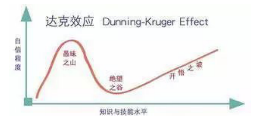
	- 上面的图片上反映出，大部分人其实都处于愚昧之巅。人能够成长为智者和大师要先从愚昧之巅，掉到绝望之谷，然后辛苦攀爬，积累知识和经验，成为智者和大师。有担当的管理者的一个重要责任，就是把下属从愚昧之巅推向绝望之谷，至于能否爬上开悟之坡，看个人造化。
	- 一个合格的技术 TL 必须要给团队成员塑造一个绝望山谷，同时还要让他看到一个开悟之坡，这样员工会不断突破自我。作为一个有担当的管理者，我们不应该是一个老好人的角色，也要有冷酷无情的一面，阿里也有一句土话“心要仁慈，刀要快”，当团队中出现一些达不到团队要求的人，管理者应该主动去拉他一把，如果多次尝试，最终达不到预期，应该请他离开。因为到了中途，再被残酷淘汰，无论对组织，还是对个人，损失都更大。
#### 如果我是一线技术主管…… 
- 作者： 谦行　前端技术专家
- 阿里妹导读：技术主管和团队成员应该是什么关系？只能是普通的领导与被领导的关系吗？如果，你作为一个一线技术主管，你会怎么管理团队？我们试试换位思考，假设自己是技术主管，反推团队成员如何做事才能获得更好的成长。
- 如果我是一线技术主管，那我可能是团队曾经综合实力最强的，我可能会被时间支配而不能再天天写代码，并且，团队充满各种挑战。
- 如果我是一线技术主管，依然是每周要写周报，每年要写绩效，想晋升，想加薪、想人生巅峰等等。
- 如果我是一线技术主管，在团队只有五、六个人的情况下还好，如果是十几个人的团队的话，会希望有人可以站出来帮我。
- 如果我是技术主管，我更希望：
1. 不抱怨
	- 如果我是一线技术主管，我不会喜欢团队有喜欢抱怨的同学：
		- 主管每天也很忙，听抱怨很消耗时间；
		- 团队有人抱怨，说明团队自然是有问题了，需要花一定的时间梳理出问题，需要及时给出解决方案，甚至要安抚对方情绪；
		- 一个喜欢抱怨的人会影响整个团队的士气。
	- 其实大部分开发抱怨的工作内容很相似，团队成员不配合做事，PD 提了无理的需求等。
	- 大促中我们的后端主管说了些很好理解的话：“看到大促有这么多问题，我很激动，这种情况很好。问题越多说明机会越大，如果都是稳定健壮的系统、完善的流程、合作良好的团队，那么，要大促 PM 干什么呢？”
	- 如果问题都是机会的话，那就没有抱怨的必要。但是，如果真的就是有问题，还不能说了吗？
1. 向上管理
	- 一个管理十几人的团队主管很难有精力做到面面俱到，去了解所有人的细节，给大家找出合适的方向和机会，甚至认真读完每个人的周报都要用一个下午，很难做到你有一个不错的想法的时候，主管就有时间找你聊聊。如果我是一线主管，我更希望团队同学主动找我聊。
	- 作为主管每天既要处理大量一线信息，又要领导团队做出正确的决策，还要照顾团队的每个成员，做出健康的梯队建设计划等，大部分人是没有这个精力的。
	- 刚开始工作的时候，我们误解主管和下属的关系就是领导与被领导的关系，但其实主管也需要被下属管理，这也就是“向上管理”的由来，简单来讲就是主管也需要下属的协助和推动。
	- 主管大部分时间很忙，这就要求下属在向上管理的时候要尤其注意高效、有质量的沟通，如果我是一线主管，我更希望团队和我交流的方式是让我做选择题、判断题，而不是问答题、思考题。
	- 很多鸡汤文提到老板训斥高管：我请你来不是告诉我为什么不行，而是告诉我怎么实现我的构想。在主管不是拍脑子就做的决定的时候，困难肯定是已经想过了，更希望得到的是下属的帮助。
	- 如果我是一线主管，我希望下属这样帮助我：
		- 主动承担团队面临的挑战，给出合理的解决方案；
		- 及时向我反馈经过整理的信息和数据，甚至是结论，辅助决策；
		- 主动关心同事，组织学习，帮助大家（包括我）进步成长。
	- 除了面对面的交流，和主管最多的沟通机会可能就是周报，这是向上管理的重要途径，然而很多同学把周报当做一种负担，写的极其敷衍，就是一周的流水账，发送出来都是浪费自己和收件人的时间。
	- 团队不会有人认真读完所有人的周报，读谁的取决于周报的质量。个人习惯粗略浏览组内所有人周报（周报有 highlights 多重要），坚持几周就能识别一些需要关注的周报，然后会针对这些人的周报设置邮件规则，必须认真看的，遇到不理解的还要过去问的，其它人的周报就被自动过滤掉了。一个普通员工都是如此，更何况一线主管。可见这么写周报可能在无意中浪费了许多次向上管理的机会。
1. 每天忙不完的业务怎么办
	- 还有一种抱怨的声音是：自己每天很辛苦，想拼命忙完业务后做一些技术的东西，造个轮子什么的，但一个需求还没做完，另外一个需求就安排过来了。
	- 如果我是一线主管，我会把团队面临的问题分一下级：
		- 重要 & 紧急，不能按时完成，则都是失败；
		- 重要不紧急，是个很好的机会；
		- 技术想法，很好的撬动业务的点；
		- 单分析只是个业务需求，看不出明显的兴奋点。
	- 团队的人可能也有几种特性：
		- 能力强，在某领域是专家；
		- 能力一般，有潜力，但是非常有积极性；
		- 能力一般，主动性一般。
	- 其实不用特意说明就知道大部分主管分配任务的思路：
		- 重要 & 紧急的事情只能交给能力强的人去做，意愿上如果有问题，也要说服对方去做，因人成事，可见能力强有多重要；
		- 重要不紧急的事情就可以借事修人，如果做得好，这个人以后就有信心了，团队多了一员干将，做不好也有能力强的人给保底，不会造成业务问题；
		- 技术想法也可以交给有积极性的人做，这必然占用一些时间，那么这个人手头上无关痛痒的事情只好交给能力一般，主动性一般的人来做。
	- 实际上按照这个向上管理的思路，需要主管去分配任务的时候，你就已经输了，甚至主管来找你问进度的时候也已经输了。
	- 当然每个合格的主管都需要发现、解决团队人才培养的问题，不可能放任问题发生。
1. 什么样的人有积极性
	- 能力强的人很好识别，那什么样的人才是有积极性的，看过一个 AE 快速升 P8 的同学写的文章，他有个很好的习惯。
	- 无论大小难易，永远不满足于做出来指定的事情，一定要给人惊喜。
	- 如果我是一线主管，我不会凭空把一件重要的事情交给某个人去做，我会更期望：
		- 团队同学来教育我某件事情很重要，想去尝试；
		- 在很多微不足道的小事情上做出了惊喜，有理由相信这件更大的事情也可能做出惊喜；
		- 我被分配了纯业务事情怎么办？
	- 上面也提到了简单分析只是业务需求，近五年在阿里将见了太多事在人为的案例，每个人身边肯定也有不少这样的案例。
	- 我们以为自己在做业务，很多时候是因为两个误区：
		- 这不是技术项目：没有什么所谓的技术项目，所有的技术项目除非是显而易见的项目，否则肯定脱胎于业务，只有业务一线的同学才可以抽象出来，做业务需求不是坏事情，拿着完成任务的心态做业务才是最要命的。
		- 没目标：所有做的事情都要契合自己的目标，而自己的目标大部分时候应该和团队目标 match。今天让我开发一个前端组件，我要看到的是这个需求反应了我营销体系对某个分类能力的缺失，需求归纳到我营销可视化体系完善的目标中，在阿里这种人才济济的环境中目标不清晰的人和咸鱼没什么区别。
1. 怎样才算业务负责人
	- 很多小伙伴已经是实际的业务负责人，和三、四个小伙伴一块解决特定业务领域问题，但尴尬的是级别相同，在分配任务的时候会不好意思，觉得对方也有自己的”技术项目”要做，我得求他把这个业务需求做一下。
	- 这种其实不算真正的业务负责人，如果业务负责人仅仅是分配任务，那么任何人辛苦一些都可以做。业务负责人的核心特质应该是有一条是了解业务的发展、引导相关人的个人目标。
	- 这样可以把业务需求转换成每个人目标中的一环，和上面提到的自己做事情思路是一样的，无非就是写代码的那个人不自己。其实即使主管也不可能命令团队成员去做某事，采用命令那样的方式，团队早晚散伙。
	- 最后，如果我是一线技术主管，我希望团队的业务负责人时刻在两个方面提醒自己：可衡量、可体系化。
